# Proposed Master Firm Profile: Korbey Lague PLLP
<!-- CountingFive — Proposed MFP: pending client review and confirmation -->
<!-- Client review step: confirm, edit, or delete individual items before finalizing -->
<!-- Source audit: korbeylague.com dated 2026-04-24 -->

---

## Section 1 — Firm Identity

| Field | Value |
|-------|-------|
| **Domain** | korbeylague.com |
| **URL** | https://www.korbeylague.com |
| **Firm Name** | Korbey Lague PLLP |
| **Former Name** | Korbey, Lague & Murphy, CPAs *(name change at some point — confirm year with client)* |
| **Year Established** | ❓ *Verify in client review* |
| **Firm Size Estimate** | 9 staff (2 partners, 7 associates/support) |
| **MFP Date** | 2026-04-24 |
| **Prepared By** | CountingFive |

### Location(s)

**Primary Office**

| Field | Value |
|-------|-------|
| **Address** | 1 Pondview Pl, Tyngsborough, MA 01879 |
| **Phone** | (978) 649-2155 |
| **Fax** | (978) 649-2160 |
| **Email** | info@korbeylague.com |
| **Tax Season Hours** | Mon–Fri 9:00am–5:00pm, Sat 9:00am–Noon (Feb 1 – Apr 15) |
| **Standard Hours** | Mon–Thu 9:00am–3:00pm, Fri by appointment only |
| **Note** | *"Partners and associates are available outside of these hours when requested."* |

---

## Section 2 — Firm Narrative

### History & Background

Korbey Lague PLLP is a full-service tax, accounting, and consulting firm based in Tyngsborough, Massachusetts, serving clients across the state. The firm was previously known as Korbey, Lague & Murphy, CPAs — the name change and restructuring as a PLLP reflects a shift in partnership composition, with Murphy no longer listed as a partner. Today the firm operates under the leadership of partners Kelsey Korbey, CPA and Ron Lague, CPA, PFS, supported by a team of seven associates and support staff. The presence of Ryan Lague on the team suggests a family continuity element worth surfacing in the firm's story.

> 📋 **Client Review Action:** Confirm founding year, the story behind the name change from Korbey, Lague & Murphy to Korbey Lague PLLP, and whether Ryan Lague's role in the family legacy is something you'd like highlighted on the new site.

### Current Positioning

> *"Inspired by your success"*

The site's current value proposition is: *"Let us take the stress out of running your business."* The homepage frames the firm's core services (Advisory/CFO, Tax, Bookkeeping & Payroll, Financial Reporting) in straightforward, stress-reduction language. The firm also prominently features a DEI commitment — a relatively rare positioning choice in the CPA space that signals cultural intentionality. The overall positioning is generic-friendly but undersells the firm's genuine differentiators: a partner holding the PFS credential, a Sage Intacct partnership, and a dedicated nonprofit practice.

### Proposed Positioning

Three framings — each built on the same differentiators but leading with a different emphasis. Client selects one in the review session.

> **Option A — "Beyond the Numbers: Financial Clarity for Businesses That Are Ready to Grow"**
> Korbey Lague PLLP brings together rare credentials and enterprise-grade tools to serve growing Massachusetts businesses the way large firms can't — personally. With two CPA partners, one of whom holds the Personal Financial Specialist (PFS) designation, and a direct Sage Intacct partnership, we offer the depth of a regional firm with the accessibility of a local one. Whether you're a nonprofit managing fund accounting, a contractor tracking job costs, or a healthcare professional protecting your practice — we build the financial clarity that lets you lead, not just comply.
>
> *Grounded in: Ron Lague's PFS credential; Sage Intacct partnership; nonprofit accounting practice; multi-industry homepage claim.*

> **Option B — "Your Business Deserves More Than Tax Season"**
> Korbey Lague PLLP has built its reputation in Tyngsborough by being the firm that's still here in July — not just April. With year-round advisory services, tiered bookkeeping packages, and a virtual CFO offering that delivers CFO-level insight at a fraction of the cost, we partner with businesses through every season, not just tax season. Our team of nine, including two CPA partners and multiple MBA-credentialed staff, treats every client like a long-term relationship — because that's what we're built for.
>
> *Grounded in: year-round positioning in tax copy; tiered bookkeeping packages; firm size and credentials.*

> **Option C — "Enterprise Expertise. Local Relationship. Real Results."**
> Running a business in Massachusetts means navigating complex tax environments, tight margins, and relentless compliance demands — without losing sight of what you actually built. Korbey Lague PLLP combines tools and credentials typically reserved for larger firms — including a Sage Intacct partnership and a Personal Financial Specialist on staff — with the personalized service only a local partner can offer. We serve businesses, nonprofits, healthcare professionals, and contractors from one office in Tyngsborough: close enough to know your name, credentialed enough to change your numbers.
>
> *Grounded in: Sage Intacct partnership; PFS credential; nonprofit practice; multi-industry positioning.*

*All three options are grounded in: Ron Lague's CPA + PFS credentials, Kelsey Korbey's CPA partnership, Sage Intacct partnership (dedicated subdomain), dedicated nonprofit accounting practice, tiered service packaging, and DEI commitment.*

> 📋 **Client Review Action:** Select preferred positioning option (A, B, or C) or note which elements to blend. This becomes the foundation of homepage copy, service page intros, and Google Business Profile description.

### Competitive Context

| Firm | Location | Size | Nonprofit | Virtual CFO | Sage Intacct | Positioning Notes |
|---|---|---|---|---|---|---|
| **Dawn Kay CPA, P.C.** | Tyngsboro, MA | Solo | ❌ | ❌ | ❌ | Privately held & family-run businesses; direct same-town competitor |
| **Hajiani CPA, LLC** | Tyngsboro, MA | Small | ❌ | ❌ | ❌ | Tax & accounting, individuals and businesses; minimal web presence |
| **John R. Michaud CPA** | Tyngsboro, MA | Solo | ❌ | ❌ | ❌ | Local presence; limited digital footprint |
| **Belanger & Company, PC** | Chelmsford, MA | Mid-size | ❌ | ❌ | ❌ | Full-service, Eastern MA/Southern NH; "high quality, low turnover" positioning |
| **SDO CPA** | Lowell, MA | Small | ❌ | ✅ | ❌ | S-Corps & small businesses; fractional CFO mentioned; digital-forward |
| **Raphael & Raphael LLP** | Boston/Eastern MA | Regional | ❓ | ❓ | ❌ | Boston-adjacent; broader reach, higher price point |

**Key Competitive Takeaways:**

- **Nonprofit + Sage Intacct is a defensible moat.** No local competitor within 10 miles has a documented nonprofit practice or technology partnership at this level. This combination is rare and immediately differentiating.
- **Korbey Lague is the only PFS-credentialed firm in the immediate competitive radius.** The PFS opens up retirement planning, estate planning, and personal financial planning services that none of the named competitors are positioned to deliver.
- **Virtual CFO is an emerging battleground.** SDO CPA in Lowell is already claiming fractional CFO services — Korbey Lague has the infrastructure to own this positioning more aggressively in its immediate market.
- **The same-town competitors (Dawn Kay, Hajiani, Michaud) are all smaller, single-practitioner operations** with limited service depth and weak digital presence. Korbey Lague has a material size and credential advantage that is currently invisible on the website.

> 📋 **Client Review Action:** Confirm competitor list. Are there others we should know about — particularly any that have recently expanded into nonprofit or advisory services? Any recent mergers or new entrants in the Tyngsborough/Lowell corridor we should be aware of?

---

## Section 3 — Accreditations, Awards & Affiliations

| Organization | Type | Evidence |
|---|---|---|
| AICPA (implied) | Professional Membership | CPA credentials held by Kelsey Korbey and Ron Lague require AICPA membership or state CPA society affiliation |
| AICPA PFS Credential | Specialty Credential | Ron Lague holds the Personal Financial Specialist (PFS) designation — awarded exclusively to CPAs by the AICPA |
| Sage Intacct | Technology Partnership | Dedicated subdomain (sageintacct.korbeylague.com) with partner-level content for nonprofits, cloud financials |
| Massachusetts Society of CPAs | Professional Membership | ❓ *Likely — verify with client* |

> 📋 **Client Review Action:** Please confirm all current memberships, accreditations, and awards (including any chamber of commerce membership, MICPA recognition, BBB accreditation, or local business awards). None of these are currently surfaced on the website and each is a trust signal worth displaying.

---

## Section 4 — Social & Digital Footprint

| Platform | URL | Followers | Activity | Notes |
|---|---|---|---|---|
| Facebook | https://www.facebook.com/korbeylaguepllp/ | 238 likes, 42 talking | Low | Active enough to be "talking about" but low organic reach |
| Instagram | Listed in site footer | ❓ Unknown | ❓ Unknown | URL not captured; verify handle |
| LinkedIn | Listed in site footer | ❓ Unknown | ❓ Unknown | URL not captured; verify company page |
| YouTube | Not found | — | Not found | No channel detected |
| Yelp | https://www.yelp.com/biz/korbey-lague-tyngsborough | Listed | Claimed | No visible reviews; services listed include tax, financial advising, accountants |

**Google Business Profile:** *(not directly confirmed — verify URL with client)*
**Review Summary:** Yelp listing is claimed with no visible reviews. No Google Business rating surfaced in research — this is a significant gap for local search visibility.

> 📋 **Client Review Action:** Provide Instagram and LinkedIn company page URLs. Do you have a Google Business Profile? If not, creating and optimizing one should be a priority action before the new site launches.

---

## Section 5 — Who They Serve

*Source: Homepage "Fields of Expertise," sitemap service pages, and digital research*

### Confirmed Target Markets

The homepage names five fields of expertise: Individuals, Healthcare Professionals, Service-based Businesses, Retail & Manufacturing, and Contractors & Trades. The firm also maintains a dedicated Nonprofit Accounting service page and a Sage Intacct subdomain with nonprofit-specific content (fund accounting, nonprofit software). In practice, Korbey Lague serves a broad cross-section of individual and business clients, with particularly strong infrastructure for nonprofits and advisory clients. No individual industry page exists for any of these audiences — they are named but not developed.

**Identified Industries:**

| Industry | Confidence | Evidence |
|---|---|---|
| Individuals / Personal Tax | Confirmed | Dedicated personal tax page; contact form includes "individual" option |
| Healthcare Professionals | Confirmed | Named on homepage "Fields of Expertise" |
| Service-based Businesses | Confirmed | Named on homepage; supported by bookkeeping & payroll packaging |
| Retail & Manufacturing | Confirmed | Named on homepage "Fields of Expertise" |
| Contractors & Trades | Confirmed | Named on homepage "Fields of Expertise" |
| Nonprofits | Confirmed | Dedicated service page (/what-we-do/nonprofit-accounting); Sage Intacct subdomain with nonprofit-specific content (fund accounting, 990 workflows) |
| Business Startups | Confirmed (weak signal) | Business Foundation Services page explicitly targets new business owners |

### Ideal Client Profile (ICP)
*Draft ICP per confirmed industry — client confirms/adjusts in review session.*

> 📋 **Client Review Action:** For each ICP, mark ✅ Accurate | ✏️ Adjust (note changes) | ❌ Remove. Add typical revenue size, how clients find you, and what makes a great client vs. a difficult one.

---

**Healthcare Professionals ICP**
*Private practice owners and medical professionals who need a financially literate partner, not just a tax preparer.*

- **Business type:** Physicians, dentists, therapists, specialists — solo practices and small group practices
- **Size range:** $500K–$5M revenue; 1–20 employees
- **Stage:** Established practice; may be early in ownership or approaching partnership/transition
- **What triggers a search:** First year owning their practice, dissatisfied with a generalist CPA, preparing for a major investment (equipment, expansion, partner buyout)
- **What they fear:** Overpaying taxes due to healthcare-specific deductions being missed; compliance failures; cash flow surprises
- **What they value:** A CPA who speaks healthcare — understands billing cycles, overhead structures, and provider compensation
- **Ideal signal:** *"I just opened my practice and I need someone who actually knows how medical practices work, not just someone who handles tax season."*

---

**Contractors & Trades ICP**
*Specialty trade and general contractors who are growing beyond what basic bookkeeping can support.*

- **Business type:** HVAC, electrical, plumbing, general contractors, landscaping — often owner-operated
- **Size range:** $500K–$5M revenue; 2–20 employees/subcontractors
- **Stage:** Growing past the owner doing everything — first hire, first commercial project, first real accounting need
- **What triggers a search:** Cash flow gets unpredictable as projects scale; workers' comp and payroll become complex; want to know if they're actually making money per job
- **What they fear:** Payroll mistakes, misclassified workers, cash surprises between job completions
- **What they value:** A CPA who understands project-based cash flow and doesn't make them feel dumb for not knowing accounting
- **Ideal signal:** *"My buddy said I should stop doing my own books. I've got 8 guys now and no idea if I'm profitable."*

---

**Nonprofits ICP**
*Small to mid-size nonprofits that need a dedicated accounting partner, not just a tax preparer.*

- **Business type:** 501(c)(3) organizations — social services, arts, education, faith-based, community foundations
- **Size range:** $500K–$5M in annual revenue; 2–25 employees
- **Stage:** Established or recently professionalized — outgrown volunteer bookkeeping
- **What triggers a search:** Board pressure for cleaner financials, upcoming grant audit requirement, executive director change, need to move to fund accounting
- **What they fear:** Grant compliance failures, 990 errors, audit findings, losing foundation trust
- **What they value:** A firm that understands fund accounting, grant restrictions, and speaks to boards in plain language
- **Ideal signal:** *"We have a grant audit coming up and our books are a mess. We need someone who actually understands how nonprofits work."*

---

**Service-based Businesses ICP**
*Established service businesses that have outgrown a bookkeeper and need strategic financial support.*

- **Business type:** Marketing agencies, professional services, cleaning/maintenance companies, salons, staffing firms
- **Size range:** $250K–$3M revenue; 2–20 employees
- **Stage:** Post-startup — profitable but not sure how profitable; want better financial visibility
- **What triggers a search:** Taxes were a surprise last year; cash flow is unclear despite being busy; looking to hire or expand
- **What they fear:** Overpaying taxes, cash flow gaps, not knowing what their business is really worth
- **What they value:** Fixed-fee pricing, regular check-ins, and not feeling like they're being billed for every question
- **Ideal signal:** *"I had a great year but somehow I owe $30K in taxes. I need someone proactive, not just reactive."*

---

**Business Startups ICP**
*New business owners who want to get the financial foundation right from day one.*

- **Business type:** New LLCs, S-corps in any industry — often transitioning from employee to owner
- **Size range:** Pre-revenue to $500K
- **Stage:** Formation to first 2 years
- **What triggers a search:** Just registered the business or about to; unsure what entity to choose; need payroll set up
- **What they fear:** Doing something wrong that costs them later; IRS penalties; missing deductions
- **What they value:** Education, patience, and a firm that will explain things without judgment
- **Ideal signal:** *"I'm starting a business and I don't even know what questions to ask. I just know I need a CPA."*

---

### Industry Sub-Category Assessment
*Status key: ✅ Confirmed on site — explicitly in copy | 🔍 Likely offered — strong inference | ❓ Verify in client review*

**Nonprofits**

| Sub-Category | Status | Notes |
|---|---|---|
| Fund Accounting | ✅ | Explicitly mentioned in nonprofit page copy: "fund accounting" |
| Day-to-Day Bookkeeping | ✅ | Nonprofit page: "day-to-day bookkeeping routines" |
| Form 990 Preparation | 🔍 | Strong inference — tax practice + dedicated nonprofit page; not explicitly stated |
| Grant Compliance & Reporting | 🔍 | Implied by "accurate data on-demand" language; Sage Intacct supports this |
| Audit Preparation (Nonprofit) | ❓ | Audit representation listed under Tax; nonprofit-specific audit support not confirmed |
| Board Financial Reporting | 🔍 | Sage Intacct partnership includes dashboard/reporting; likely offered |

**Contractors & Trades**

| Sub-Category | Status | Notes |
|---|---|---|
| Job Costing & Profitability | ❓ | Not explicitly mentioned; standard for contractors — verify |
| Cash Flow Management | 🔍 | Advisory/CFO page includes cash flow analysis; applicable to contractors |
| Progress Billing & AR | ❓ | Not confirmed on site |
| Payroll for Contractors | ✅ | Bookkeeping & Payroll includes garnishment remittance, 1099 prep for contractors |
| Tax Planning — Contractor-Specific | 🔍 | Tax page mentions year-round support; contractor-specific deductions not called out |

**Healthcare Professionals**

| Sub-Category | Status | Notes |
|---|---|---|
| Practice Profitability & Growth | 🔍 | Advisory/CFO services cover KPI and profitability analysis; healthcare not named |
| Provider Compensation Models | ❓ | Not confirmed |
| AR Management & Collections | ❓ | Not confirmed — significant gap for healthcare clients |
| Overhead Cost Analysis | 🔍 | COGS and expense analysis in CFO menu; applicable to healthcare |
| Compliance & Reporting | ❓ | Healthcare-specific compliance not named |

**Service Businesses**

| Sub-Category | Status | Notes |
|---|---|---|
| Job Profitability Tracking | ✅ | CFO services explicitly include "revenue and profits" and "industry KPI analysis" |
| Recurring Revenue & Service Contracts | 🔍 | Fixed-fee bookkeeping model suggests understanding of recurring revenue |
| Team Productivity & Efficiency | 🔍 | Payroll analysis in CFO menu |
| Materials & Inventory Management | ❓ | Retail & Manufacturing mentioned on homepage; not confirmed in service copy |
| Growth & Capacity Planning | ✅ | CFO menu includes budgeting and tax planning/projections |

---

### Team-Derived Audience Opportunities

- **Ron Lague, CPA, PFS** has expertise in personal financial planning → Unleveraged audience: **High-net-worth individuals and business owners approaching retirement**
  *Opportunity: The PFS credential authorizes full financial planning services including retirement, estate, and investment planning — a service line not marketed anywhere on the current site, with strong demand in the greater Lowell/northern MA market.*

- **Jackie Estes, MBA** and **Mike Riordan, MBA** bring business management credentials → Unleveraged audience: **Growing SMBs seeking strategic financial leadership**
  *Opportunity: MBA-credentialed staff add credibility to the Virtual CFO offering; highlighting this in bios and on the CFO page would strengthen the proposition for clients evaluating fractional CFO services.*

---

## Section 6 — Services Inventory

*Source: Sitemap, service page scrapes, and homepage analysis*

**Niche Clarity Score:** 2/10 | **Grade:** F
*(Services exist and are well-structured, but are described in entirely generic language with no industry-specific framing.)*

### Confirmed Services

| Service | Clarity | Current Framing | Rewrite Direction |
|---|---|---|---|
| Advisory & Virtual CFO | Moderate | Process-focused | Lead with outcomes: "Know exactly where your business stands — every month, not just tax season" |
| Tax – Personal | Clear | Outcome-focused | Add trigger-based copy: who needs this and when |
| Tax – Business | Moderate | Mixed | Segment by industry; surface entity analysis and audit representation more prominently |
| Bookkeeping (Basic/Standard/Complete) | Clear | Outcome-focused | Strongest service page — keep tiers; add niche-specific examples per tier |
| Payroll | Clear | Outcome-focused | Add contractor/1099 distinction; compliance framing for growing businesses |
| Financial Reporting | Unclear | Process-focused | Reframe from "we prepare statements" to "you get real-time visibility into your numbers" |
| Nonprofit Accounting | Moderate | Outcome-focused | Good foundation — add fund accounting depth, 990 reference, grant compliance language |
| Business Foundation Services | Clear | Outcome-focused | Strong new-owner framing; could link to Startup ICP page |
| Accounting System Setup | Moderate | Process-focused | Reframe toward business intelligence outcomes; feature Sage Intacct partnership here |
| Business Metrics & Performance | Unclear | Process-focused | This is the Virtual CFO's core deliverable — merge or cross-link to strengthen both pages |
| Entity Type Analysis | Moderate | Process-focused | Embed into Tax or Business Foundation; low standalone value |
| Tax Notices & Audit Representation | Clear | Outcome-focused | Good — keep; consider adding IRS audit section for peace-of-mind framing |
| Financial Statement Preparation | Unclear | Process-focused | Sub-page of Financial Reporting — consolidate or redirect |

> 📋 **Client Review Required — Virtual CFO / Advisory Details**
> This service is featured prominently and is a major differentiator. The content strategy depends on these specifics — please bring to the review session:
> - How many active Advisory/CFO clients do you currently serve?
> - What industries do most Advisory clients come from?
> - What does a typical onboarding look like?
> - Do you have 1–2 specific client outcomes (before/after, decisions made, dollars saved)?
> - Is the Advisory service priced separately from bookkeeping tiers?

---

### High-Opportunity Niches (Currently Invisible)

| Niche | Rationale |
|---|---|
| **Wealth Management / Retirement Planning** | Ron Lague's PFS credential enables full personal financial planning services; no competitor in the immediate market holds this designation |
| **Estate Planning Support** | Natural extension of PFS + CPA; high-net-worth individuals in the Tyngsborough/Lowell corridor are underserved by local firms |
| **Closely Held Family Businesses** | Ryan Lague on staff + Ron Lague as founding partner signals family business understanding; this audience values continuity and trust — a natural ICP |

### Team-Derived Service Opportunities

- **Ron Lague, CPA, PFS** has expertise in **personal financial planning** → Unleveraged service: **Wealth & Retirement Planning advisory**
  *Market case: Fewer than 8,000 CPAs nationwide hold the PFS designation; this credential is the firm's clearest differentiator and is currently not mentioned anywhere on the website.*

- **Jackie Estes, MBA + Mike Riordan, MBA** have **business management credentials** → Unleveraged service: **Strategic CFO consulting for growth-stage businesses**
  *Market case: The MBA credentials on advisory staff add legitimacy to the Virtual CFO offering; featuring them in bios strengthens conversion for high-value CFO clients.*

---

## Section 7 — Team & Credentials

### Kelsey Korbey, CPA
**Title:** Partner
**External Footprint:** Minimal *(no external digital presence found)*

| Attribute | Detail |
|---|---|
| **Credentials** | CPA |
| **Previous Employers** | ❓ *Not found in external research* |
| **Areas of Expertise** | ❓ *Not found — verify with client* |
| **Niche Signals** | None detected externally |
| **Associations** | ❓ *Likely Massachusetts Society of CPAs — verify* |
| **Published / Speaking** | None found |

**Bio Summary:** Kelsey Korbey is a CPA and named partner at Korbey Lague PLLP, Tyngsborough, MA. No external professional footprint was found during research — her credentials, background, and niche expertise should be developed in the review session and featured on the new site's team page.

**Leverage Opportunities:**
- Full bio with credentials, specializations, and a personal note would significantly strengthen conversion on the team page
- If Kelsey has specific niche expertise (e.g., healthcare, nonprofits, contractors), that should be surfaced on the relevant industry pages

---

### Ron Lague, CPA, PFS
**Title:** Partner
**External Footprint:** Minimal *(name appears in firm directory listings but no individual profile found)*

| Attribute | Detail |
|---|---|
| **Credentials** | CPA, PFS (Personal Financial Specialist — AICPA designation) |
| **Previous Employers** | ❓ *Not found in external research* |
| **Areas of Expertise** | Tax, financial planning, personal finance (inferred from PFS) |
| **Niche Signals** | Personal financial planning, retirement, estate planning (all PFS-implied) |
| **Associations** | AICPA (required for PFS credential) |
| **Published / Speaking** | None found |

**Bio Summary:** Ron Lague is a CPA and Personal Financial Specialist (PFS), one of fewer than 8,000 CPAs in the United States to hold this AICPA-designated credential. The PFS authorizes comprehensive financial planning services including retirement planning, estate planning, and wealth management — services well beyond standard CPA scope. His designation is the firm's single greatest differentiator and is currently invisible on the website.

**Leverage Opportunities:**
- The PFS designation is the firm's #1 unleveraged asset — it should appear in the firm's positioning statement, Ron's bio, the homepage About block, and a dedicated Wealth & Retirement Planning service page
- If Ron has specific niche focus areas from his career history, those should be developed in the review session

---

### Tanya Lombardi
**Title:** Office Manager
**External Footprint:** Minimal

| Attribute | Detail |
|---|---|
| **Credentials** | None listed |
| **Bio Summary** | Office Manager; internal operations and client-facing administrative role |

---

### Kristine Ciccarelli
**Title:** ❓ *Not listed on site*
**External Footprint:** Minimal

| Attribute | Detail |
|---|---|
| **Credentials** | None listed |
| **Notes** | Role and background unknown — verify title and expertise for bio |

---

### Jackie Estes, MBA
**Title:** ❓ *Not listed on site*
**External Footprint:** Minimal

| Attribute | Detail |
|---|---|
| **Credentials** | MBA |
| **Areas of Expertise** | Business management (inferred from MBA) |
| **Notes** | MBA credential strengthens the Advisory/CFO service offering — verify specific focus areas |

**Leverage Opportunities:**
- MBA credential should be featured in bio and cross-linked to the Advisory/CFO service page
- Verify specific expertise (finance, operations, strategy) to determine if additional service opportunities exist

---

### Mike Riordan, MBA
**Title:** ❓ *Not listed on site*
**External Footprint:** Minimal

| Attribute | Detail |
|---|---|
| **Credentials** | MBA |
| **Areas of Expertise** | Business management (inferred from MBA) |
| **Notes** | Second MBA on team; valuable for advisory positioning |

**Leverage Opportunities:**
- Alongside Jackie Estes, having two MBA-credentialed staff on a 9-person team is unusual and should be featured as part of the Virtual CFO/Advisory positioning

---

### Ryan Lague
**Title:** ❓ *Not listed on site*
**External Footprint:** Minimal

| Attribute | Detail |
|---|---|
| **Credentials** | None listed |
| **Notes** | Likely related to Ron Lague — this family legacy angle may be worth developing in the firm narrative if client is open to it |

---

### Richard DelGaudio, CPA
**Title:** ❓ *Not listed on site*
**External Footprint:** Minimal

| Attribute | Detail |
|---|---|
| **Credentials** | CPA |
| **Notes** | Three CPAs on staff (Kelsey, Ron, Richard) is strong for a 9-person firm — this should be highlighted |

**Leverage Opportunities:**
- Third CPA on staff adds service depth credibility; verify Richard's areas of expertise for bio and potential niche page contribution

---

### Scott Denisevich
**Title:** ❓ *Not listed on site*
**External Footprint:** Minimal

| Attribute | Detail |
|---|---|
| **Credentials** | None listed |
| **Notes** | Role unknown — verify for bio |

---

## Section 8 — Reputation & Trust Signals

**Overall Sentiment:** Not found *(insufficient public reviews to assess)*
**Google Rating:** *(not confirmed — Google Business Profile status unknown)*
**Yelp Rating:** Listed and claimed; no reviews visible in research
**BBB Status:** Not found

### Review Themes
**Praise:** *(none found — no visible public reviews)*
**Concerns:** *(none noted)*

### Press & Media
- No press mentions or media appearances found in external research

### Trust Signal Gaps
*Elements that exist externally but are missing from the website:*

- **No on-site testimonials.** There are no client testimonials, case studies, or success stories anywhere on the site — despite the firm's tenure and multi-industry practice. This is the single highest-impact conversion gap on the entire site.
- **Ron Lague's PFS credential is completely invisible.** The designation doesn't appear on the website, his team photo, or anywhere in the firm's marketing — a significant missed trust signal.
- **No Google Business Profile confirmation.** Without a verified GBP with reviews, the firm doesn't appear as a trusted local option in Google's local pack — the most visible position in local CPA search results.
- **No awards or affiliations displayed.** If the firm holds any chamber memberships, CPA society involvement, or local business recognition, none of it is visible on the website.
- **Sage Intacct partnership is buried.** The partnership appears on the homepage footer and a dedicated subdomain but isn't framed as a differentiator — most visitors won't know what it means or why it matters.

---

## Section 9 — Content Gap Analysis

### Niche Gaps
*Audiences or industries the firm has credibility to serve but has zero dedicated web presence for:*

- **Healthcare Professionals** — Named on the homepage but has no dedicated industry page, no healthcare-specific service language, and no copy addressing the unique needs of medical practices (billing cycles, overhead, provider compensation). This is a high-value niche with above-average billings.
- **Contractors & Trades** — Named on the homepage; no dedicated page, no job-costing or project-billing language, no appeal to the specific pain points of this audience.
- **Retail & Manufacturing** — Named on the homepage with no supporting content or industry page.
- **Wealth & Retirement Planning** — Ron Lague's PFS credential enables full financial planning services that are not marketed anywhere on the site. This represents an entirely unleveraged revenue stream.
- **Closely Held Family Businesses** — Natural fit given the firm's apparent family heritage (Ron + Ryan Lague), but no copy targets this audience.

### Authority Gaps
*Credentials, awards, pedigree, and tenure that are not visible on the site:*

- **PFS Credential** — Ron Lague's Personal Financial Specialist designation is the firm's strongest differentiator and is completely absent from the website. It should appear in the homepage, the team page, the About section, and a dedicated service page.
- **Three CPAs on a 9-person team** — Having Kelsey Korbey, Ron Lague, and Richard DelGaudio all credentialed as CPAs is above average for a firm this size and should be part of the firm's authority claim.
- **Two MBAs on staff** — Jackie Estes and Mike Riordan bring business management credentials that reinforce the Advisory/CFO proposition but are not featured anywhere.
- **Sage Intacct Partnership** — Positioned on the site but not framed as an authority signal. Most clients won't know that Sage Intacct is an enterprise-grade platform typically used by mid-market companies and nonprofits — this needs context and framing.
- **Firm tenure / founding story** — No founding year is displayed anywhere; the firm's history and the name change from Korbey, Lague & Murphy are unexplained. Tenure builds trust in professional services.

### Conversion Gaps
*Missing elements that would help website visitors become clients:*

- **No testimonials anywhere.** This is the most impactful single change available — even 3–4 client quotes would materially improve conversion.
- **Weak CTAs throughout.** Most service pages end with a reCAPTCHA-protected contact form and nothing else. There are no phone-number CTAs, no "book a call" offers, and no incentive to act.
- **No Google Business Profile with reviews** — clients can't find or validate the firm through Google's local results.
- **Hours show limited availability.** Mon–Thu 9am–3pm, Fri closed outside tax season reads as restrictive to potential clients. The "partners available outside hours on request" note in the hours page should be on every service page and the homepage.
- **No FAQ or prospect education.** Common questions ("What's the difference between tax preparation and tax planning?" "When should I hire a CPA vs. a bookkeeper?") are entirely unanswered, leaving money on the table for a firm with strong educational instincts.

### Team Expertise Gaps
*Capabilities the firm has but doesn't market:*

- **Ron Lague, PFS** → Personal financial planning, retirement planning, estate planning coordination — not marketed, not mentioned
- **Jackie Estes, MBA** → Business strategy and management consulting depth — credential visible in photo caption but unexplained
- **Mike Riordan, MBA** → Same as above — second MBA on staff is unusual; unexplained on site
- **Richard DelGaudio, CPA** → Third CPA on staff; expertise unknown and not marketed

---

## Section 10A — Current Site Map

*134 URLs confirmed from sitemap.xml as of 2026-04-24. The sitemap structure reflects the firm's Rootworks-built CMS architecture. Used for redirect planning during site rebuild.*

**Primary Pages (confirmed live):**

| Current URL | Page Title | Status |
|---|---|---|
| / | Home | Live |
| /who-we-are | Who We Are (Team) | Live |
| /what-we-do | Services Hub | Live |
| /what-we-do/virtual-cfo-services | Advisory & Virtual CFO | Live |
| /what-we-do/business-foundation-services | Business Foundation Services | Live |
| /what-we-do/business-management-services | Business Management Services | Live |
| /what-we-do/accounting-system-setup | Accounting System Setup | Live |
| /what-we-do/business-metrics-and-performance-measurement | Business Metrics & Performance | Live |
| /what-we-do/tax | Tax – Individual and Business | Live |
| /what-we-do/personal-tax | Personal Tax | Live |
| /what-we-do/business-tax | Business Tax | Live |
| /what-we-do/entity-type-analysis | Entity Type Analysis | Live |
| /what-we-do/tax-notices-and-audit-representation | Tax Notices & Audit Representation | Live |
| /what-we-do/bookkeeping-and-payroll | Bookkeeping & Payroll | Live |
| /what-we-do/bookkeeping | Bookkeeping | Live |
| /what-we-do/payroll | Payroll | Live |
| /what-we-do/financial-reporting | Financial Reporting | Live |
| /what-we-do/financial-statement-preparation | Financial Statement Preparation | Live |
| /what-we-do/nonprofit-accounting | Nonprofit Accounting | Live |
| /resources | Resources | Live |
| /resources/resource-library | Resource Library | Live |
| /resources/magazine | Magazine / Articles | Live |
| /resources/blog | Blog | Live |
| /resources/refund-tracker | Refund Tracker | Live |
| /hours | Office Hours | Live |
| /contact | Contact | Live |
| /meet-our-team/ | Meet Our Team | → redirects to homepage (JS-rendered) |
| /about | About | → redirects to homepage (no standalone page) |
| /contact-us | Contact Us | → redirects to homepage |
| sageintacct.korbeylague.com/* | Sage Intacct Subdomain | External subdomain — not migrated |

*Note: 134 sitemap entries include many blog/magazine articles at /resources/magazine/ and /resources/blog/ — these redirect plans are addressed in bulk below.*

### Redirect Planning Table

*Developers: implement these as 301 redirects before or immediately at launch.*

| Current URL | Current Page | Action | New URL |
|---|---|---|---|
| /what-we-do | Services Hub | 301 Redirect | /services |
| /what-we-do/virtual-cfo-services | Advisory & Virtual CFO | 301 Redirect | /services/virtual-cfo-advisory |
| /what-we-do/business-foundation-services | Business Foundation Services | 301 Redirect | /services/business-startup-accounting |
| /what-we-do/business-management-services | Business Management Services | Consolidate | → /services/virtual-cfo-advisory |
| /what-we-do/accounting-system-setup | Accounting System Setup | Consolidate | → /services/virtual-cfo-advisory |
| /what-we-do/business-metrics-and-performance-measurement | Business Metrics | Consolidate | → /services/virtual-cfo-advisory |
| /what-we-do/tax | Tax Hub | 301 Redirect | /services/tax |
| /what-we-do/personal-tax | Personal Tax | 301 Redirect | /services/tax/personal-tax |
| /what-we-do/business-tax | Business Tax | 301 Redirect | /services/tax/business-tax |
| /what-we-do/entity-type-analysis | Entity Type Analysis | Consolidate | → /services/tax/business-tax |
| /what-we-do/tax-notices-and-audit-representation | Tax Notices & Audit | 301 Redirect | /services/tax/audit-representation |
| /what-we-do/bookkeeping-and-payroll | Bookkeeping & Payroll Hub | 301 Redirect | /services/bookkeeping-payroll |
| /what-we-do/bookkeeping | Bookkeeping | Consolidate | → /services/bookkeeping-payroll |
| /what-we-do/payroll | Payroll | Consolidate | → /services/bookkeeping-payroll |
| /what-we-do/financial-reporting | Financial Reporting | 301 Redirect | /services/financial-reporting |
| /what-we-do/financial-statement-preparation | Financial Statement Prep | Consolidate | → /services/financial-reporting |
| /what-we-do/nonprofit-accounting | Nonprofit Accounting | 301 Redirect | /industries/nonprofits |
| /who-we-are | Who We Are / Team | 301 Redirect | /about/our-team |
| /meet-our-team/ | Meet Our Team | 301 Redirect | /about/our-team |
| /about | (no standalone page) | New Page | /about |
| /hours | Office Hours | 301 Redirect | /contact (merge into contact page) |
| /contact | Contact | No Change | /contact |
| /contact-us | (redirects to home) | 301 Redirect | /contact |
| /resources | Resources | No Change | /resources |
| /resources/resource-library | Resource Library | No Change | /resources |
| /resources/magazine/* | Magazine articles | 301 Redirect | /resources/articles/* (bulk) |
| /resources/blog/* | Blog articles | 301 Redirect | /resources/articles/* (bulk) |
| /resources/refund-tracker | Refund Tracker | No Change | /resources/refund-tracker |
| *(no current URL)* | *(n/a — new content)* | New Page | /about/our-story |
| *(no current URL)* | *(n/a — new content)* | New Page | /services/wealth-retirement-planning |
| *(no current URL)* | *(n/a — new content)* | New Page | /industries/healthcare-professionals |
| *(no current URL)* | *(n/a — new content)* | New Page | /industries/contractors-trades |
| *(no current URL)* | *(n/a — new content)* | New Page | /industries/retail-manufacturing |
| *(no current URL)* | *(n/a — new content)* | New Page | /industries/service-businesses |
| *(no current URL)* | *(n/a — new content)* | New Page | /industries/business-startups |

---

## Section 10B — Proposed Site Map

*Tailored to Korbey Lague PLLP's confirmed services, identified niches, team structure, and content gap analysis.*
*Annotation key: ✅ existing content (needs polishing) · 🆕 new page (addresses a gap) · 📈 exists but needs major depth improvement*

```mermaid
graph TD
    Home["🏠 Home 📈"] --> About["About 🆕"]
    Home --> Services["Services 📈"]
    Home --> Industries["Industries / Who We Serve 🆕"]
    Home --> Resources["Resources ✅"]
    Home --> Contact["Contact 📈"]

    About --> Story["Our Story 🆕"]
    About --> Team["Our Team 📈"]

    Services --> CFO["Advisory & Virtual CFO 📈"]
    Services --> Tax["Tax 📈"]
    Services --> Bookkeeping["Bookkeeping & Payroll 📈"]
    Services --> Reporting["Financial Reporting 📈"]
    Services --> Nonprofit["Nonprofit Accounting 📈"]
    Services --> Wealth["Wealth & Retirement Planning 🆕"]
    Services --> Startup["Business Startup Accounting 📈"]

    Tax --> PersonalTax["Personal Tax ✅"]
    Tax --> BusinessTax["Business Tax 📈"]
    Tax --> AuditRep["Audit Representation ✅"]

    Industries --> Healthcare["Healthcare Professionals 🆕"]
    Industries --> Contractors["Contractors & Trades 🆕"]
    Industries --> Retail["Retail & Manufacturing 🆕"]
    Industries --> ServiceBiz["Service Businesses 🆕"]
    Industries --> NonprofitInd["Nonprofits 📈"]
    Industries --> FamilyBiz["Closely Held Family Businesses 🆕"]

    Resources --> Articles["Articles & Magazine ✅"]
    Resources --> RefundTracker["Refund Tracker ✅"]
    Resources --> Portal["Client Portal ✅"]
```



**Why this structure:**
- `/about/our-story` is 🆕 because the firm has no founding narrative, no founding year displayed, and an unexplained name change — all of which erode trust
- `/services/wealth-retirement-planning` is 🆕 because Ron Lague's PFS credential enables this service line and no competitor in the market is offering it
- `/industries/*` pages are all 🆕 or 📈 because the homepage names five industries but has zero dedicated pages for any of them
- `/about/our-team` is 📈 because the current team page shows photos with names and credentials only — no bios, no specializations, no human story
- `Nonprofit Accounting` moves from `/what-we-do/` to `/industries/nonprofits` because it's audience-based positioning, not a standalone service
- Homepage is 📈 not ✅ because current positioning undersells the firm's credentials

**Site Map — Text Tree**

```
Home 📈
├── About 🆕
│   ├── Our Story 🆕
│   └── Our Team 📈
├── Services 📈
│   ├── Advisory & Virtual CFO 📈
│   ├── Tax 📈
│   │   ├── Personal Tax ✅
│   │   ├── Business Tax 📈
│   │   └── Audit Representation ✅
│   ├── Bookkeeping & Payroll 📈
│   ├── Financial Reporting 📈
│   ├── Nonprofit Accounting 📈
│   ├── Wealth & Retirement Planning 🆕
│   └── Business Startup Accounting 📈
├── Industries / Who We Serve 🆕
│   ├── Healthcare Professionals 🆕
│   ├── Contractors & Trades 🆕
│   ├── Retail & Manufacturing 🆕
│   ├── Service Businesses 🆕
│   ├── Nonprofits 📈
│   └── Closely Held Family Businesses 🆕
├── Resources ✅
│   ├── Articles & Magazine ✅
│   ├── Refund Tracker ✅
│   └── Client Portal ✅
└── Contact 📈
```

---

## Section 11 — Before You Review

*Read this before your MFP review session. Most items just need a "yes / correct / delete." The items below are what we cannot research — gathering them in advance keeps the session focused on strategy.*

### What to Have Ready

**About the firm:**
- [ ] Founding year — when was Korbey Lague (or its predecessor) established?
- [ ] The story behind the name change from Korbey, Lague & Murphy to Korbey Lague PLLP
- [ ] Is Ryan Lague related to Ron? Is the family legacy angle something you'd like to feature?
- [ ] Any corrections to team titles, credentials, or roles in Section 7
- [ ] Any awards, certifications, or memberships we missed (chamber, MSCPA, BBB, local business awards)
- [ ] Do you have a Google Business Profile? If yes, what's the URL?

**About Ron Lague's PFS credential:**
- [ ] How long has Ron held the PFS designation?
- [ ] Do you currently offer personal financial planning, retirement planning, or wealth advisory services — or is this an area you'd like to grow into?
- [ ] Any client outcomes tied to financial planning (retirements planned, tax savings from integrated planning) worth sharing?

**About the Advisory / Virtual CFO service:**
- [ ] How many active Advisory clients do you currently have?
- [ ] What industries do most of your Advisory clients come from?
- [ ] 1–2 specific client outcomes — before/after, decisions made, dollars saved or found
- [ ] Is the Advisory engagement priced separately from bookkeeping tiers?

**About your clients:**
- [ ] Rough breakdown of your current book by client type (e.g., "~30% individuals, ~25% service businesses, ~20% nonprofits")
- [ ] Typical revenue size for business clients in each industry
- [ ] How do clients most commonly find you? (referral, Google, directory, existing relationship?)
- [ ] 2–3 specific client success stories — one or two from your strongest niches. Format: *"Client type, situation they came to us with, what we did, what the outcome was."* These become case study copy on industry pages.

**About the new services and niches we've flagged:**
- [ ] Wealth & Retirement Planning: do you actively offer this now, or is it an area to grow into?
- [ ] For each ❓ item in the Industry Sub-Category Assessment (Section 5): quick yes/no on whether you offer it

**About your competitive landscape:**
- [ ] Any corrections to the competitor list in Section 2 (especially any recent new entrants in Tyngsborough/Lowell)?
- [ ] Are you seeing more clients mention any specific competitor by name?

**Visual and content assets:**
- [ ] Professional headshots: which team members have current, professional photos?
- [ ] Office photo(s): do you have exterior and/or interior shots?
- [ ] Any industry-specific photos (client sites, job photos, nonprofit events)?
- [ ] Client testimonials: can you provide 3–5 written testimonials or reach out to happy clients for quotes before the review session?
