# Proposed Master Firm Profile: McKeown Kraai Professional CPAs
<!-- CountingFive — Proposed MFP: pending client review and confirmation -->
<!-- Client review step: confirm, edit, or delete individual items before finalizing -->
<!-- Source audit: mkpcpa.com dated 2026-04-22 | MFP generated: 2026-04-23 -->
<!-- Skill: master-firm-profile v1.0 | Audit data: used (domain match confirmed) -->

---

## Section 1 — Firm Identity

| Field | Value |
|-------|-------|
| **Domain** | mkpcpa.com |
| **URL** | https://www.mkpcpa.com |
| **Firm Name** | McKeown Kraai Professional CPAs |
| **DBA / Short Name** | MKPCPA |
| **Year Established** | 1985 |
| **Incorporated** | December 14, 2004 (LLC) |
| **Firm Size Estimate** | 13–15 staff (2 partners, 4–5 CPA managers, 1 EA, staff accountants, admin) |
| **MFP Date** | 2026-04-23 |
| **Prepared By** | CountingFive |

### Location — Primary Office

| Field | Value |
|-------|-------|
| **Address** | 500 Edward St, Middleville, MI 49333 |
| **Phone** | (269) 795-7927 |
| **Email** | info@mkpcpa.com |
| **Business Hours** | Monday–Friday, 8:00 AM – 5:00 PM |
| **Region Served** | Southwest Michigan |

---

## Section 2 — Firm Narrative

### History & Background

McKeown Kraai Professional CPAs was founded in 1985 by Scott and Debby McKeown in Middleville, Michigan — a firm built from the ground up in a farming and small-business community. Jeff Kraai became a partner in 1995, establishing the partnership structure that defined the firm for the next decade. In 2004 the firm formally incorporated as an LLC. Today, with Kyle D. McKeown and Michael H. McKeown at the helm and a staff of 13+, MKPCPA has served Southwest Michigan businesses across four decades — making it one of the longest-tenured CPA firms in the region.

The founding family's roots in the local community run deep: Scott and Debby McKeown were honored as Thornapple Kellogg Distinguished Alumni and recipients of a Hometown Hero recognition from the Thornapple Area Enrichment Foundation. That community identity — family-first, locally invested, personally accountable — carries through to the current generation of leadership.

### Current Positioning

> *"Helping people succeed from a family first perspective."*

The site leads with service utility — "let us take the stress out of running your business" — and communicates warmth and accessibility. The BOSS advisory product carries an effective CFO-value positioning: "Get the expert guidance of a CFO...at a fraction of the cost." However, the messaging stops short of connecting the firm's exceptional external credibility (Big 4 pedigree, Farm Bureau speaking, EA credential, state award, 40-year tenure) to the prospect's decision-making process.

### Proposed Positioning

Three framings built on the same differentiators, each leading with a different emphasis. Select one in the review session (or blend elements):

> **Option A — The Big 4 + Working Farmer angle** *(leads with credentialed expertise)*
> *Southwest Michigan's only CPA firm where a partner is both a Big 4 tax veteran and a working farmer — bringing enterprise-level tax strategy to the agricultural and family-owned businesses that need it most. For 40 years and counting, McKeown Kraai has been the firm Southwest Michigan trusts when the stakes are real: IRS audits, farm succession, business growth, and everything in between.*

> **Option B — The 40-Year Community Trust angle** *(leads with tenure and relationships)*
> *For four decades, Southwest Michigan farms, contractors, and family businesses have brought McKeown Kraai their most consequential financial decisions — from first payroll to farm succession to IRS defense. Some clients have been with us longer than our partners have been CPAs. That's not a tagline. It's a track record.*

> **Option C — Enterprise Expertise, Local Commitment** *(leads with the firm's rare combination)*
> *McKeown Kraai brings Big Four tax strategy and a partner who farms to the businesses that built Southwest Michigan — agriculture, construction, manufacturing, and family enterprise. Big enough to handle what the large firms handle. Local enough to know your name and your operation.*

*All three grounded in: 40-year operating history · Kyle McKeown's Deloitte and PwC background · Kyle's personal farming background and USDA/FSA expertise · Michael McKeown's Farm Bureau speaking role and farm succession specialization · Felecia Meyering's Enrolled Agent credential · 2025 MICPA Small Firm Award.*

> 📋 **Client Review Action:** Select preferred positioning option (A, B, or C) or note which elements to blend. This becomes the foundation of homepage copy, service page intros, and Google Business Profile description.

### Competitive Context

*7 firms researched in the Barry County / Southwest Michigan competitive radius.*

| Firm | Location | Size | Ag Claimed | Construction Claimed | Key Notes |
|---|---|---|---|---|---|
| **Phillips Tax & Consulting** | Hastings, MI (Barry County) | Solo/2-person | ✅ Yes | ✅ Yes | Most direct local competitor — overlaps MKP's core niches but limited credentials |
| **Barry Associates Inc** | Richland, MI (~10 mi) | Mid-size | ❌ No | ❌ No | 35-year firm; broad tax focus; no niche industry claims |
| **Rehmann** | Hastings location + regional | Large (1,100+) | ❌ No | ✅ Yes | Regional heavyweight in Barry County; agriculture absent from niche claims |
| **Maner Costerisan** | Lansing / Grand Rapids (merged Jan 2026) | Large (150+) | ✅ Yes | ✅ Yes | ⚠️ Strongest threat: 100+ yr firm, 6th largest in Michigan, Baker Holtz merger expands GR presence |
| **Stephen Ross & Company** | Stevensville, MI (~20 mi south) | Small–Mid | ❌ No | ✅ Yes | 34-year construction/manufacturing specialist; no agriculture |
| **Hungerford CPAs + Advisors** | Grand Rapids (5 locations) | Large (75+ yrs) | ❌ No | ✅ Yes | Largest locally owned CPA in West Michigan; construction/mfg strong; no agriculture |
| **TKH Group, PC** | Otsego, MI (~15 mi south) | Small (solo) | ❌ No | ✅ Yes | Local Allegan County firm; construction only |

**Key Competitive Takeaways:**
- **Agriculture is MKP's clearest defensible niche.** Only 2 of 7 competitors claim agriculture — one is a solo practice (Phillips Tax) with no equivalent credentials. Maner Costerisan is the only credentialed threat but targets larger clients from a 150-person regional firm.
- **Construction is commoditized.** All 5 serious competitors claim construction. MKP must lead with construction depth (job costing, certified payroll, bonding guidance) rather than just claiming the niche.
- **The Big 4 + working farmer combination is unmatched locally.** No competitor can credibly claim this pairing.
- **The Maner Costerisan / Baker Holtz merger (January 2026) is the headline competitive development.** A 150-person statewide firm now has expanded Grand Rapids presence with explicit ag, construction, and manufacturing claims. MKP's response: lead harder on the personal, community-rooted, family-owned identity a 150-person firm cannot replicate.

> 📋 **Client Review Action:** Confirm competitor list accuracy. Are there others we should know about? Is the Maner Costerisan expansion already being felt in client conversations?

---

## Section 3 — Accreditations, Awards & Affiliations

| Organization | Type | Evidence |
|---|---|---|
| AICPA (American Institute of CPAs) | Professional Membership | Listed on site and referenced in partner association research |
| Michigan Society of CPAs (MICPA) | Professional Membership + Award | 2025 MICPA Small Firm Award winner — statewide recognition |
| Michigan Farm Bureau | Speaking Engagement / Association | Michael McKeown featured speaker at Growing Together 2025 |
| Family Business Alliance | Board Membership | Kyle McKeown serves on the Board of Directors |
| Barry County Chamber of Commerce | Business Membership (Advocate level) | Confirmed via association research |
| Thornapple Area Enrichment Foundation | Community Recognition | Scott & Debby McKeown Hometown Hero / matching donation relationship |
| Thornapple Kellogg Schools | Community Recognition | Scott & Debby McKeown Distinguished Alumni honorees |

---

## Section 4 — Social & Digital Footprint

| Platform | URL | Followers | Activity | Notes |
|---|---|---|---|---|
| LinkedIn (Company) | https://www.linkedin.com/company/mckeown-kraai-plc | Unknown | Active | Individual partner profiles confirmed |
| Facebook | https://www.facebook.com/MKPCPA/ | Unknown | Active | Community posts, firm culture content |
| Instagram | https://www.instagram.com/mkpcpa/ | Unknown | Low | Minimal post frequency |
| Twitter/X | *(not found)* | — | Not Found | No account detected |
| YouTube | *(not confirmed)* | — | Minimal | Small Firm Award video exists; no active channel confirmed |

**Google Business Profile:** Not confirmed in local pack — Yelp listing at yelp.com/biz/mckeown-and-kraai-cpas-middleville is **unclaimed**.
**Review Summary:** ★ 3.7 (6 Google reviews) — warm and friendly staff, professional and knowledgeable, long-term client retention (8+ year relationships noted). Yelp unclaimed; BBB profile inactive.

---

## Section 5 — Who They Serve

*Source: Audit target market analysis + team expertise cross-reference*

### Confirmed Target Markets

The firm explicitly markets to four industries. The messaging establishes that these audiences exist but doesn't yet speak their language — niche-specific vocabulary, pain points, and industry-standard outcomes are largely absent from the body copy.

**⚠️ Important finding:** The agriculture, construction, and manufacturing industry pages (`/agriculture`, `/construction`, `/manufacturing`) redirect to the homepage — they do not exist as live pages. The "dedicated pages" referenced in site audits are actually homepage redirects. The new site's industry section is entirely net-new content.

| Industry | Confidence | Evidence |
|---|---|---|
| Agriculture & Farming | Confirmed (Strong) | Referenced in navigation + Michael McKeown's Farm Bureau speaking + Kyle McKeown is himself a farmer |
| Construction | Confirmed | Referenced in navigation ("accounting solutions designed for the Construction Industry") |
| Manufacturing | Confirmed | Referenced in navigation ("dedicated, strategic insight into your accounting") |
| Business Startups | Confirmed | Dedicated service pages: `/what-we-do/business-foundation-services`, `/what-we-do/entity-type-analysis` |

### Ideal Client Profile (ICP)

*Drafted from research and industry knowledge. Client confirms, corrects, or adjusts in the review session.*

> 📋 **Client Review Action:** For each ICP, mark ✅ Accurate | ✏️ Adjust (note changes) | ❌ Remove. Add typical revenue size, how clients usually find you, and what makes a great client vs. a difficult one.

---

**Agriculture & Farming ICP**
*The farm operator or farm family that needs a CPA who actually understands their world.*

- **Operation type:** Family farm operations — row crops (corn, soybeans), livestock, mixed operations; primarily in Barry, Allegan, Kalamazoo, and Kent counties
- **Size range:** 200–2,500 acres or equivalent livestock operation; second- or third-generation family ownership common
- **Stage:** Established and operating, often at a transition inflection point (expansion, succession, estate planning)
- **What triggers a search:** Complex tax situation (large equipment purchase, crop insurance payment, land sale), USDA/FSA loan or compliance question, family succession becoming urgent, dissatisfaction with a general CPA who "doesn't get farming"
- **What they fear:** Paying too much tax on farm income, getting an IRS letter, making the wrong entity decision, the farm not surviving to the next generation
- **What they value:** A CPA who has been on a farm, understands seasonal cash flow, won't talk down to them, and is available when they need to make a fast decision
- **Ideal signal:** *"Our last CPA didn't understand farm income averaging. Does yours?"*

---

**Construction ICP**
*The growing contractor who has outgrown "my wife does the books" but isn't big enough for a full-time CFO.*

- **Business type:** General contractors, subcontractors (electrical, plumbing, HVAC, concrete), specialty trades
- **Revenue range:** $500K–$5M annual revenue; 5–40 employees
- **Stage:** Growth phase — winning larger projects, hiring crews, needing bonding, cash flow harder to manage
- **What triggers a search:** Cash flow crisis between projects, not knowing which jobs made money, needing a bank loan or bonding letter, payroll complexity (certified payroll, prevailing wage)
- **What they fear:** Running out of cash between a project payment and the next draw, underbidding jobs, IRS problems from misclassified workers, not being able to bond a bigger job
- **What they value:** A CPA who understands construction cycles, can look at a job bid and tell them if it makes sense, and will answer the phone in September not just March
- **Ideal signal:** *"We just landed our biggest project. I need someone who can help me not screw this up."*

---

**Manufacturing ICP**
*The established Southwest Michigan manufacturer who needs real financial management, not just tax filing.*

- **Business type:** Job shop manufacturers, component suppliers, food processing, custom fabrication in the I-196/US-131 corridor
- **Revenue range:** $1M–$10M annual revenue; 10–75 employees
- **Stage:** Established and profitable but lacking financial visibility — margins feel squeezed, inventory is hard to track
- **What triggers a search:** Line of credit renewal requiring reviewed financials, cost accounting question their current CPA can't answer, interest in acquiring a competitor or selling the business
- **What they fear:** Not knowing true cost of goods, margin erosion, tax complexity from depreciation elections and inventory methods
- **What they value:** A CPA who can speak to cost accounting, not just tax compliance; who will help them think about the business, not just file the return
- **Ideal signal:** *"I think we're profitable but I can't tell you why our cash is always tight."*

---

**Business Startups ICP**
*The local entrepreneur who wants to get the financial foundation right from day one.*

- **Business type:** New ventures of all kinds — professional services, retail, trades, technology, food; founder-led, typically pre-revenue to first $500K
- **Stage:** Pre-launch to 18 months in; often working a day job simultaneously
- **What triggers a search:** Starting a business and not knowing how to set up properly, first employee, first quarterly tax payment, securing a small business loan
- **What they fear:** Making a costly entity election mistake, IRS compliance issues in year one, not knowing what they don't know
- **What they value:** Clear, plain-English guidance; a CPA who will explain not just do; someone who can grow with the business
- **Ideal signal:** *"I'm starting a business and I want to set it up right. Where do I begin?"*

---

### Industry Sub-Category Assessment
*Status key: ✅ Confirmed on site — explicitly in copy | 🔍 Likely offered — strong inference | ❓ Verify in client review*

---

**Agriculture**

| Sub-Category | Status | Notes |
|---|---|---|
| Farm Cash Flow & Seasonal Planning | 🔍 | Ag niche confirmed; seasonal cash flow management is standard for this audience but not named explicitly on site |
| Crop & Livestock Basis Tracking | ❓ | Kyle McKeown is a working farmer — plausible expertise, but no site copy or search result confirms as a service offering |
| FSA/USDA Compliance & Reporting | ❓ | Kyle's personal farming background suggests familiarity; not marketed on site — confirm scope with client |
| Equipment Depreciation & Cost Recovery | 🔍 | Tax planning is confirmed core service; Section 179 and bonus depreciation for farm equipment is standard ag tax work |
| Farm Succession & Estate Planning | 🔍 | Michael McKeown's stated specialty per digital research; deeply connected to Farm Bureau community; not visible on site |

---

**Construction**

| Sub-Category | Status | Notes |
|---|---|---|
| Job Costing & Profitability | 🔍 | Standard for any CPA serving contractors; confirm depth of implementation (real-time vs. periodic) |
| Cash Flow Management | 🔍 | BOSS advisory product and CFO-level positioning makes this a natural offering |
| Progress Billing & AR | ❓ | No site copy or research references progress billing or retainage — verify with client |
| Strategic Growth Planning | 🔍 | BOSS product explicitly offers "expert guidance of a CFO at a fraction of the cost" — applies naturally to construction |
| Tax Planning | ✅ | Tax Planning & Preparation is a confirmed core service site-wide |

---

**Manufacturing**

| Sub-Category | Status | Notes |
|---|---|---|
| Job Costing & Work-in-Process (WIP) Tracking | ❓ | Manufacturing niche confirmed; job costing specifics need client confirmation |
| Inventory Valuation & COGS Analysis | 🔍 | Standard for any product-based manufacturer; likely included in bookkeeping and financial statement work |
| Overhead Allocation & Variance Analysis | ❓ | More sophisticated cost accounting level — verify whether in scope |
| Cash Flow & Working Capital Management | 🔍 | BOSS advisory positioning applies; consistent with advisory service offered |
| Growth & Capacity Planning | 🔍 | BOSS/CFO-level advisory is the firm's flagship differentiator; natural extension |

---

**Business Startups**

| Sub-Category | Status | Notes |
|---|---|---|
| Entity Formation & Structure | ✅ | `/what-we-do/entity-type-analysis` is a live page explicitly offering this service |
| Chart of Accounts & Accounting System Setup | ✅ | `/what-we-do/accounting-system-setup` is a live page — confirmed service |
| Payroll Setup & Compliance | ✅ | Payroll is a confirmed core service; startup payroll setup naturally included |
| Cash Runway & Burn Rate Planning | ❓ | Consistent with BOSS advisory but not confirmed for startups specifically |
| Investor/Lender Financial Preparation | ❓ | Michael McKeown's audit capability would support this; not marketed — flag for confirmation |

---

### Team-Derived Audience Opportunities
*These audiences are not currently marketed to, but team expertise directly supports serving them:*

- **Kyle McKeown** has expertise in **USDA farm programs and FSA requirements** → Unleveraged audience: **Farm operators navigating USDA/FSA compliance**
  *Opportunity: Farmers managing FSA loans, CRP contracts, and USDA payment programs need specialized CPA guidance that almost no competitor in Southwest Michigan is explicitly offering.*

- **Kyle McKeown** is **himself a working farmer** → Unleveraged positioning: **"Your CPA is also a farmer" differentiation on the Agriculture page**
  *Opportunity: Authentic credibility that no competitor can replicate — a CPA who farms is uniquely positioned to understand the financial reality of agricultural clients.*

- **Kyle McKeown** serves on the **Family Business Alliance Board of Directors** → Unleveraged audience: **Closely held family businesses and multi-generational ownership transitions**
  *Opportunity: Family businesses facing succession, buy-sell agreements, and estate planning need an advisor with both CPA credentials and real organizational experience.*

- **Michael McKeown** specializes in **closely held family businesses and financial statement audits** → Unleveraged audience: **Family-owned businesses needing audited or reviewed financials**
  *Opportunity: Many lenders, investors, and government contracts require audited financial statements — a capability the firm has but does not advertise.*

- **Michael McKeown** specializes in **farm succession and family business transitions** → Unleveraged audience: **Farm families navigating generational ownership changes**
  *Opportunity: Farm succession is one of the most complex and emotionally charged financial events a family faces; Southwest Michigan's agricultural community has active demand for this expertise.*

- **Felecia Meyering (EA)** is authorized to **represent clients before the IRS** → Unleveraged audience: **Business owners and individuals facing IRS audits, collections, or appeals**
  *Opportunity: IRS trouble is a fear-driven, high-urgency need; an EA on staff who can represent clients is a powerful differentiator that no current site page communicates.*

---

## Section 6 — Services Inventory

*Source: Audit niche & services intelligence + team expertise cross-reference*

**Niche Clarity Score:** 6.7/10 | **Grade:** C+

### Confirmed Services

| Service | Clarity | Current Framing | Rewrite Direction |
|---|---|---|---|
| Bookkeeping | Clear | Process-focused | Lead with time savings and owner focus; add niche applications (construction job costing, ag enterprise tracking) |
| Payroll | Clear | Mixed | Call out niche complexity: certified payroll for construction, seasonal ag worker filings |
| Tax Planning & Preparation | Clear | Outcome-focused | Add industry-specific strategies: cost segregation, Section 179, farm income averaging, entity election for startups |
| Business Advisory (BOSS) | Moderate | Outcome-focused | Lead with the CFO-at-a-fraction-of-the-cost headline; add concrete advisory outcomes and industries served |

> 📋 **Client Review Required — BOSS Product Details**
> The BOSS advisory product is the firm's primary differentiator from tax-only competitors. Content strategy for the advisory page depends on these details:
> - **What does BOSS stand for?** *(site says "Business Operations & Strategic Services" — confirm)*
> - **What is specifically included?** (Monthly cadence? Quarterly reviews? KPI dashboards? CFO-on-call?)
> - **Who is the ideal BOSS client?** (Revenue size, industry, stage)
> - **Current pricing structure?**
> - **Approximately how many active BOSS clients?**
> - **1–2 specific client outcomes you're proud of** (before/after, dollar impact, decision made) — these become the case study copy

---

### High-Opportunity Niches (Currently Invisible on Site)

| Niche | Rationale |
|---|---|
| Closely Held Family Businesses | Michael McKeown's primary specialty; Kyle's Family Business Alliance board seat; no dedicated page or messaging |
| Farm Succession & Estate Planning | Both partners have depth here; deeply needed in SW Michigan ag community; Farm Bureau connection lends credibility |
| IRS Audit Defense & Tax Controversy | Felecia Meyering's EA credential enables full IRS representation; not mentioned anywhere on the site |
| Audit & Assurance Services | Michael McKeown's credentials support financial statement audits and reviews; needed by businesses seeking bank loans |
| Business M&A Advisory | Kyle McKeown's Big 4 background included M&A-adjacent tax work; small business M&A is active in SW Michigan |
| USDA / FSA Compliance for Farm Operators | Kyle McKeown's specific farm program expertise; no competitor in SW Michigan is explicitly marketing this |

### Team-Derived Service Opportunities

- **Kyle McKeown** has expertise in **USDA farm programs, FSA requirements, and agricultural tax strategy** → Unleveraged service: **USDA/FSA Compliance & Ag Tax Strategy**
  *Market case: Few CPA firms in SW Michigan explicitly market USDA/FSA compliance support; Kyle's personal farming background makes this authentic.*

- **Kyle McKeown** has **M&A advisory experience from Deloitte** → Unleveraged service: **Business Acquisition & Sale Advisory**
  *Market case: Local business owners buying or selling need tax-efficient deal structures; Big 4-trained M&A guidance at a local firm price is a compelling differentiator.*

- **Michael McKeown** provides **financial statement audits and reviews** → Unleveraged service: **Audit & Assurance Services**
  *Market case: Growth-stage businesses, those seeking bank loans, and businesses with outside investors frequently require audited or reviewed financials — completely invisible on the site.*

- **Felecia Meyering (EA)** can **represent clients before the IRS** in audits, collections, and appeals → Unleveraged service: **IRS Representation & Audit Defense**
  *Market case: Small business owners fear IRS audits above almost everything else; a firm with an EA commands premium trust and pricing.*

---

## Section 7 — Team & Credentials

---

### Kyle D. McKeown, CPA, MSA
**Title:** Partner / Owner | **External Footprint:** Strong

| Attribute | Detail |
|---|---|
| **Credentials** | CPA, MSA (Master of Science in Accounting) |
| **Education** | Michigan State University — BA; MSA |
| **Previous Employers** | Deloitte (Tax Services Lead, 2006–2008); PricewaterhouseCoopers (Intern) |
| **With Firm Since** | 2008 |
| **Areas of Expertise** | Tax planning & strategy, business startups, M&A guidance, agriculture / farm accounting, USDA farm programs, FSA requirements, entity selection, deal advisory |
| **Personal** | Is himself a working farmer — brings lived agricultural experience to client work |
| **Niche Signals** | Agriculture, family business, startup formation, tax strategy |
| **Associations** | Family Business Alliance (Board of Directors), AICPA, Michigan Society of CPAs, Barry County Chamber |
| **Published / Speaking** | *(none confirmed in this research cycle)* |

**Bio Summary:** Kyle McKeown brought Big 4 tax strategy expertise from Deloitte and PwC when he joined the family firm in 2008. A CPA, MSA, and working farmer, he brings both enterprise-level tax acumen and lived agricultural experience to every farming client engagement — a combination that no competitor in Southwest Michigan can credibly replicate. His seat on the Family Business Alliance Board signals recognized expertise in closely held and multi-generational business transitions.

**Leverage Opportunities:**
- Big 4 background (Deloitte Tax Lead) → *Enterprise-level tax strategy at a local firm* — not mentioned on homepage or any service page
- Personal farming background → *"Your CPA is also a farmer"* — the most authentic agriculture differentiator possible; absent from the Agriculture page
- USDA/FSA expertise → *Ag compliance and farm program strategy* — highly specific capability invisible on the site
- Family Business Alliance Board seat → *Family business succession advisory* — signals expertise that warrants a dedicated service or industry page
- M&A guidance capability → *Business acquisition and sale advisory* — differentiator for growth-stage and exit-planning clients

---

### Michael H. McKeown, CPA, MSA
**Title:** Partner / Owner | **External Footprint:** Strong

| Attribute | Detail |
|---|---|
| **Credentials** | CPA, MSA (Master of Science in Accounting) |
| **Education** | Michigan State University — BA; MSA |
| **With Firm Since** | 2013 |
| **Areas of Expertise** | Closely held family businesses, financial statement audits and reviews, farm and agricultural accounting, business succession planning, farm succession and generational transitions |
| **Background** | Lifetime agricultural background; grew up farming before entering professional accounting |
| **Niche Signals** | Agriculture, closely held family businesses, audit & assurance, farm succession |
| **Associations** | AICPA, Michigan Society of CPAs, Michigan Farm Bureau (Growing Together 2025 speaker), Thornapple Area Enrichment Foundation |
| **Published / Speaking** | Growing Together 2025 — Featured speaker, Michigan Farm Bureau |

**Bio Summary:** Michael McKeown is a CPA and MSA with a lifetime rooted in agriculture — he grew up farming before earning his accounting credentials and joining the family firm in 2013. His specialty in closely held family businesses and farm succession planning reflects both professional training and personal experience, making him a uniquely credible advisor for the agricultural and family-business clients who represent the firm's core identity. His Michigan Farm Bureau speaking engagement is the strongest external credibility signal the firm currently has.

**Leverage Opportunities:**
- Farm Bureau speaking engagement → *"Our partner speaks at Farm Bureau because he's an agricultural accounting expert"* — must appear on Agriculture page; currently invisible
- Closely held family business specialty → *Family business CPA services* — a high-value segment with no dedicated page
- Financial statement audits and reviews → *Audit & Assurance capability* — completely unmarketed; businesses needing bank-required audited financials can't find this
- Farm succession planning → *One of the most complex financial events a farm family faces* — a dedicated service page would capture high-intent agricultural prospects

---

### Felecia A. Meyering, EA
**Title:** Staff Accountant (Senior) | **External Footprint:** Minimal

| Attribute | Detail |
|---|---|
| **Credentials** | EA (Enrolled Agent — highest IRS-designated tax credential) |
| **With Firm Since** | 2016 |
| **Experience** | 10+ years of accounting experience |
| **Areas of Expertise** | Corporate tax, individual tax, tax controversy, IRS representation and audit defense, collection matters, IRS appeals |
| **EA Credential Meaning** | Licensed by the IRS to represent taxpayers in audits, collections, and appeals — the only non-attorney, non-CPA credential that grants full IRS representation rights |
| **Niche Signals** | Tax controversy, IRS representation, individual and corporate tax |

**Bio Summary:** Felecia Meyering joined MKP in 2016 with over a decade of accounting experience and an Enrolled Agent credential — the highest IRS-recognized designation for tax professionals. As an EA, she can represent clients directly before the IRS in audits, collections, and appeals, a capability that goes beyond tax preparation and offers real protection when clients face IRS scrutiny.

**Leverage Opportunities:**
- EA credential → *IRS Audit Defense & Representation service* — business owners facing IRS contact need this; it is not mentioned anywhere on the site

---

### Derrick Brock, CPA, BSBA
**Title:** Manager | **External Footprint:** Minimal–Moderate

| Attribute | Detail |
|---|---|
| **Credentials** | CPA, BSBA (Central Michigan University) |
| **With Firm Since** | 2017 |
| **Previous Employers** | SpartanNash; Member Advantage Mortgage; Global Forex Trading |
| **Areas of Expertise** | Corporate tax, individual tax, financial statement preparation, audit support |
| **Background** | Middleville native; strong community ties |

**Bio Summary:** Derrick Brock is a Middleville native and CPA manager who joined the firm in 2017 after experience at SpartanNash and financial services firms. His background spans corporate tax, individual tax, and financial statement preparation, and his deep local roots reinforce the firm's hometown identity.

**Leverage Opportunities:**
- Local roots + financial statement prep → *Reinforce the firm's community identity and depth of corporate tax capability*

---

### Additional Team Members

| Name | Title | Credentials | Notes |
|---|---|---|---|
| Thomas Hamilton | Manager | CPA | Manager-level CPA; additional background not found |
| Marisa Ostrowski | Manager | CPA, MSA | MSA credential signals advanced tax expertise |
| Sarah Palmer | Manager | CPA | Manager-level CPA |
| Nathan Seeber | Manager | CPA | Manager-level CPA |
| Emily Frazer | Client Accounting Services Manager | — | Long-tenured; manages client accounting services delivery |
| Ashley Lantinga | Director of Culture & Relations | — | Public face of firm culture; featured in award coverage |
| Caitlyn Johnson | Staff Accountant | — | |
| Hannah Meloche | Staff Accountant | — | |
| Lindsey Knechtges | Client Accounting Services | — | |
| Adam Gigandet | IT Specialist | — | Internal technology and systems management |
| Dan Kenyon | Administrative Assistant | — | Administrative support |

---

## Section 8 — Reputation & Trust Signals

**Overall Sentiment:** Positive
**Google Rating:** ★ 3.7 (6 reviews) — *from prior audit research*
**Yelp Status:** Listing exists at yelp.com/biz/mckeown-and-kraai-cpas-middleville — **unclaimed**
**BBB Status:** Profile inactive — not accredited, no complaints on record

### Review Themes
**Praise:** Warm and friendly staff, professional and knowledgeable, personalized service, family-first culture, long-term client relationships (8+ years noted)
**Concerns:** *(none noted in accessible reviews)*

### Press & Media
- MICPA Small Firm Award 2025 — statewide recognition for innovation and trusted advisor excellence (YouTube + MICPA/LinkedIn coverage)
- Growing Together 2025 — Michigan Farm Bureau speaker slate featuring Michael H. McKeown
- McKeowns Humbled by Hometown Hero Honors — Thornapple Kellogg Schools Distinguished Alumni recognition (Scott & Debby McKeown)
- MKP Reindeer Night — 10th annual community event (The Sun and News, Nov 2025)

### Trust Signal Gaps
*Elements that exist externally but are completely missing from the website:*
- **No on-site testimonials with niche attribution** — Google reviews confirm long-term loyal clients but none of this social proof appears on the site
- **2025 MICPA Small Firm Award not on homepage** — A state-level recognition invisible to first-time visitors
- **Kyle's Big 4 experience absent** — Enterprise-level tax credentials at a local firm price; not mentioned anywhere
- **Felecia's EA credential invisible** — IRS representation capability completely unmentioned
- **Yelp unclaimed** — Limiting the firm's ability to collect and respond to reviews
- **No Google Local Pack presence** — The highest-intent local search position is not captured

---

## Section 9 — Content Gap Analysis

### Niche Gaps
- **Closely Held Family Businesses** — Michael McKeown's stated specialty and Kyle's Family Business Alliance role; no page, no mention, no CTA
- **Farm Succession & Estate Planning** — Both partners have depth here; no page exists despite active SW Michigan demand
- **IRS Audit Defense & Tax Controversy** — Felecia Meyering's EA credential authorizes full IRS representation; completely invisible
- **Audit & Assurance Services** — Michael McKeown's credentials support audits required by lenders and investors; not listed as a service
- **Business M&A Advisory** — Kyle's Deloitte background; small business acquisitions and sales are active in SW Michigan
- **USDA / FSA Compliance for Farm Operators** — Kyle McKeown's highly specific expertise; no competitor in SW Michigan markets this

### Authority Gaps
- **2025 MICPA Small Firm Award** — Not on homepage; not in site header/footer; invisible to first-time visitors
- **Kyle McKeown's Big 4 Experience (Deloitte + PwC)** — Absent from homepage, bio, and all service pages
- **Kyle McKeown as a Working Farmer** — The single most authentic differentiator for agricultural prospects; not on the Agriculture page
- **Kyle McKeown's Family Business Alliance Board Seat** — Signals recognized expertise in family business transitions; not mentioned
- **Felecia Meyering's EA Credential** — Highest IRS-recognized tax designation; invisible on the site
- **40-Year Operating History** — "Founded 1985" does not appear on the homepage; a 4-decade tenure is a rare and powerful trust signal
- **Founding Family Legacy** — Scott and Debby McKeown's community recognition is part of the firm's identity story but untold on the site

### Conversion Gaps
- **No niche-attributed testimonials** — Reviews exist; they just aren't on the site where they convert prospects
- **No Google Maps local pack visibility** — The highest-intent local search position goes uncaptured
- **Yelp unclaimed** — Preventing review collection and reputation management
- **No IRS representation CTA** — Prospects facing an IRS letter have no clear path to reach MKP
- **No farm succession consultation offer** — A high-value, high-urgency engagement point with no CTA
- **No dedicated family business advisory path** — Michael's specialty; no way for a family business owner to self-identify and reach out

### Team Expertise Gaps
- **Kyle McKeown** — USDA/FSA farm program expertise → no page content, no service offering
- **Kyle McKeown** — Farmer himself → not used on Agriculture page as the defining differentiator it is
- **Kyle McKeown** — M&A deal advisory capability → not listed as a service
- **Kyle McKeown** — Family Business Alliance Board experience → family business audience not addressed
- **Michael McKeown** — Audit & assurance capability → not a listed service
- **Michael McKeown** — Farm succession specialization → buried; no dedicated page or CTA
- **Felecia Meyering** — IRS representation and audit defense → completely invisible

---

## Section 10A — Current Site Map

*23 live pages confirmed from sitemap (mkpcpa.com/sitemap.xml) as of 2026-04-22.*
*Used for redirect planning during the site rebuild.*

**⚠️ Key discovery:** The industry pages (`/agriculture`, `/construction`, `/manufacturing`) are **not live pages** — they redirect to the homepage. The current site uses `/what-we-do/` for services and `/resources/` for content. The proposed `/industries/` section is entirely net-new content.

### Live Pages (23 confirmed)

| Current URL | Page Title | Notes |
|---|---|---|
| `/` | Home | Main homepage |
| `/what-we-do` | What We Do | Services landing page |
| `/what-we-do/boss` | BOSS Service | Business Operations & Strategic Services |
| `/what-we-do/bookkeeping` | Bookkeeping Services | Core service detail |
| `/what-we-do/payroll` | Payroll Services | Core service detail |
| `/what-we-do/tax` | Tax Services | Core service detail |
| `/what-we-do/business-foundation-services` | Business Foundation Services | Startup services |
| `/what-we-do/entity-type-analysis` | Entity Type Analysis | Entity selection consulting |
| `/what-we-do/accounting-system-setup` | Accounting System Setup | QuickBooks/software setup |
| `/what-we-do/business-management-services` | Business Management Services | Ongoing advisory |
| `/who-we-are` | Who We Are | About / team overview |
| `/contact` | Contact | Contact form |
| `/pay-bill` | Pay Bill | Client payment portal |
| `/resources` | Resource Library | Content hub |
| `/resources/blog` | Blog | Article archive |
| `/resources/resource-library` | Resource Library | Downloadable guides |
| `/resources/forms-documents-and-links` | Forms & Documents | Client forms and links |
| `/resources/safe-send` | Safe Send | Secure file transfer |
| `/resources/refund-tracker` | Refund Tracker | Tax refund status tool |
| `/resources/careers` | Careers | Job listings |
| `/resources/e-books` | E-Books | Downloadable e-books |
| `/resources/quick-reads` | Quick Reads | Short-form articles |
| `/resources/magazine` | Magazine | Business magazine |

### Legacy URLs (redirect to homepage)

`/about` · `/about-us` · `/services` · `/agriculture` · `/construction` · `/manufacturing` · `/industries` · `/blog` · `/articles` · `/team` · `/our-team` · `/contact-us` · `/careers` · `/join-our-team` · `/client-portal` · `/portal`

### Redirect Planning Table

*Developers: implement as 301 redirects at launch.*

| Current URL | Current Page | Action | New URL |
|---|---|---|---|
| `/` | Home | **No change** | `/` |
| `/what-we-do` | Services Overview | **301 Redirect** | `/services` |
| `/what-we-do/boss` | BOSS Service | **301 Redirect** | `/services/business-advisory` |
| `/what-we-do/bookkeeping` | Bookkeeping | **301 Redirect** | `/services/bookkeeping` |
| `/what-we-do/payroll` | Payroll | **301 Redirect** | `/services/payroll` |
| `/what-we-do/tax` | Tax Services | **301 Redirect** | `/services/tax` |
| `/what-we-do/business-foundation-services` | Business Foundation | **301 Redirect** | `/industries/business-startups` |
| `/what-we-do/entity-type-analysis` | Entity Type Analysis | **301 Redirect** | `/industries/business-startups` |
| `/what-we-do/accounting-system-setup` | Accounting System Setup | **301 Redirect** | `/industries/business-startups` |
| `/what-we-do/business-management-services` | Business Management | **301 Redirect** | `/services/business-advisory` |
| `/who-we-are` | About / Team | **301 Redirect** | `/about` |
| `/contact` | Contact | **No change** | `/contact` |
| `/pay-bill` | Pay Bill | **No change** | `/pay-bill` |
| `/resources` | Resource Hub | **No change** | `/resources` |
| `/resources/blog` | Blog | **No change** | `/resources/blog` |
| `/resources/resource-library` | Downloads | **Consolidate** | `/resources` |
| `/resources/forms-documents-and-links` | Forms | **301 Redirect** | `/resources/forms` |
| `/resources/safe-send` | Safe Send | **No change** | `/resources/safe-send` |
| `/resources/refund-tracker` | Refund Tracker | **No change** | `/resources/refund-tracker` |
| `/resources/careers` | Careers | **301 Redirect** | `/about/careers` |
| `/resources/e-books` | E-Books | **No change** | `/resources/e-books` |
| `/resources/quick-reads` | Quick Reads | **Consolidate** | `/resources/blog` |
| `/resources/magazine` | Magazine | **No change** | `/resources/magazine` |
| `/about`, `/about-us` | (legacy) | **301 Redirect** | `/about` |
| `/services` | (legacy) | **301 Redirect** | `/services` |
| `/blog`, `/articles` | (legacy) | **301 Redirect** | `/resources/blog` |
| `/team`, `/our-team` | (legacy) | **301 Redirect** | `/about` |
| `/contact-us` | (legacy) | **301 Redirect** | `/contact` |
| `/careers`, `/join-our-team` | (legacy) | **301 Redirect** | `/about/careers` |
| *(no current URL)* | *(new)* | **New Page** | `/services/audit-assurance` |
| *(no current URL)* | *(new)* | **New Page** | `/services/irs-representation` |
| *(no current URL)* | *(new)* | **New Page** | `/industries` |
| *(no current URL)* | *(new)* | **New Page** | `/industries/agriculture` |
| *(no current URL)* | *(new)* | **New Page** | `/industries/construction` |
| *(no current URL)* | *(new)* | **New Page** | `/industries/manufacturing` |
| *(no current URL)* | *(new)* | **New Page** | `/industries/business-startups` |
| *(no current URL)* | *(new)* | **New Page** | `/industries/family-business` |
| *(no current URL)* | *(new)* | **New Page** | `/industries/farm-succession` |
| *(no current URL)* | *(new)* | **New Page** | `/about/awards` |
| *(no current URL)* | *(new)* | **New Page** | `/resources/faq` |

> 📋 **Client Review Action:** Review the redirect table and flag any missed URLs. Are there any high-traffic pages (check Google Analytics) needing special redirect attention? Any URLs Google My Business or external sites link to directly?

---

## Section 10B — Proposed Site Map

*Tailored to McKeown Kraai's confirmed services, identified niches, team structure, and content gap analysis.*
*Annotation key: ✅ existing content (needs polishing) · 🆕 new page (addresses a gap) · 📈 exists but needs major depth improvement*

```mermaid
graph TD
    Home["🏠 Home ✅"] --> About["About Us 📈"]
    Home --> Services["Services 📈"]
    Home --> Industries["Industries / Who We Serve 🆕"]
    Home --> Resources["Resources ✅"]
    Home --> Contact["Contact ✅"]
    Home --> PayBill["Pay Bill ✅"]

    About --> Story["Our Story ✅"]
    About --> Team["Our Team 📈"]
    About --> Awards["Awards & Recognition 🆕"]
    About --> Careers["Careers ✅"]

    Services --> Tax["Tax Planning & Preparation 📈"]
    Services --> Bookkeeping["Bookkeeping 📈"]
    Services --> Payroll["Payroll 📈"]
    Services --> Advisory["Business Advisory (BOSS) 📈"]
    Services --> Audit["Audit & Assurance Services 🆕"]
    Services --> IRS["IRS Representation & Audit Defense 🆕"]

    Industries --> Ag["Agriculture & Farming 🆕"]
    Industries --> Construction["Construction 🆕"]
    Industries --> Mfg["Manufacturing 🆕"]
    Industries --> Startups["Business Startups 🆕"]
    Industries --> FamBiz["Closely Held Family Businesses 🆕"]
    Industries --> FarmSucc["Farm Succession & Estate Planning 🆕"]

    Resources --> Blog["Blog / Articles ✅"]
    Resources --> Forms["Forms & Documents ✅"]
    Resources --> SafeSend["Safe Send ✅"]
    Resources --> Refund["Refund Tracker ✅"]
    Resources --> EBooks["E-Books ✅"]
    Resources --> Magazine["Magazine ✅"]
    Resources --> FAQ["FAQs 🆕"]
```



**Why this structure:**
- All industry pages are 🆕 — the current site has no live industry pages (they redirect to home)
- `Awards & Recognition` is 🆕 — the 2025 MICPA award, Deloitte/PwC pedigree, and Hometown Hero recognition have no home on the current site
- `Audit & Assurance Services` is 🆕 — Michael McKeown's audit capability is completely unmarketed
- `IRS Representation & Audit Defense` is 🆕 — Felecia Meyering's EA credential creates a service the firm should be selling; fear of IRS contact drives high-intent searches
- `Farm Succession & Estate Planning` is 🆕 — both partners have depth here; one of the highest-urgency decisions in an agricultural family's life
- `Closely Held Family Businesses` is 🆕 — Michael's specialty and Kyle's Family Business Alliance board seat both point to this audience
- `FAQs` is 🆕 — high-anxiety questions (What happens in an IRS audit? How does farm succession work?) capture search intent and build trust

**Site Map — Text Tree**

```
Home ✅
├── About Us 📈
│   ├── Our Story ✅
│   ├── Our Team 📈
│   ├── Awards & Recognition 🆕
│   └── Careers ✅
├── Services 📈
│   ├── Tax Planning & Preparation 📈
│   ├── Bookkeeping 📈
│   ├── Payroll 📈
│   ├── Business Advisory (BOSS) 📈
│   ├── Audit & Assurance Services 🆕
│   └── IRS Representation & Audit Defense 🆕
├── Industries / Who We Serve 🆕
│   ├── Agriculture & Farming 🆕
│   ├── Construction 🆕
│   ├── Manufacturing 🆕
│   ├── Business Startups 🆕
│   ├── Closely Held Family Businesses 🆕
│   └── Farm Succession & Estate Planning 🆕
├── Resources ✅
│   ├── Blog / Articles ✅
│   ├── Forms & Documents ✅
│   ├── Safe Send ✅
│   ├── Refund Tracker ✅
│   ├── E-Books ✅
│   ├── Magazine ✅
│   └── FAQs 🆕
├── Contact ✅
└── Pay Bill ✅
```

---

## Section 11 — Before You Review

*Read this before your MFP review session. Most items just need a "yes / correct / delete." The items below are what we cannot research — gathering them in advance keeps the session on strategy.*

### What to Have Ready

**About the firm:**
- [ ] Any corrections to firm history, staff count, titles, or credentials in Section 7
- [ ] Any awards, certifications, or memberships missing from Section 3

**About BOSS:**
- [ ] Full scope of what's included in a BOSS engagement (monthly? quarterly? what deliverables?)
- [ ] Ideal BOSS client profile (size, industry, stage)
- [ ] Current pricing structure
- [ ] Number of active BOSS clients
- [ ] 1–2 specific BOSS client outcomes (before/after, dollar impact, decision made)

**About your clients:**
- [ ] Rough breakdown of your current book by industry (e.g., "~40% ag, ~30% construction")
- [ ] Typical client revenue size for each industry you serve
- [ ] How clients most commonly find you (referral, Google, Farm Bureau, Chamber, etc.)
- [ ] 2–3 specific client success stories — one per industry if possible. Format: *"Client type, situation they came to us with, what we did, what the outcome was."* These become case study copy on your industry pages.

**About the new services and niches we've flagged:**
- [ ] For each item in "High-Opportunity Niches" (Section 6): do you currently offer it, or would you need to build it? (yes we do this / not yet / maybe)
- [ ] For sub-category items marked ❓ in Section 5: quick yes/no on whether you offer each one

**About your competitive landscape:**
- [ ] Any corrections or additions to the competitor list in Section 2
- [ ] Is the Maner Costerisan / Baker Holtz merger being felt in your market yet?
- [ ] Any competitor you know you consistently win against — and why?

**Visual and content assets:**
- [ ] Professional headshots: which team members have them?
- [ ] Farm/field photos showing the ag connection?
- [ ] Office photos?
- [ ] Existing videos beyond the Small Firm Award announcement?
- [ ] Any existing blog articles worth keeping or repurposing?

### What We'll Decide Together in the Session

1. Which positioning option (A, B, or C) resonates — or what to blend
2. Which invisible services and niches to actively add to the new site
3. Which ❓ sub-category items are confirmed, adjusted, or removed
4. Final sitemap — which proposed pages to build, which to defer
5. Content priorities — what gets written first

---

## Section 12 — Pipeline Tracker

| Stage | Status | Notes |
|---|---|---|
| Audit Delivered | ✅ Complete | HTML report: audit-mkpcpa-com-2026-04-22.html |
| Proposed MFP Generated | ✅ Complete | This document — generated 2026-04-23 |
| Client MFP Review | ⬜ Pending | Interactive session — client confirms/edits/deletes items |
| MFP Confirmed | ⬜ Pending | |
| Content Strategy | ⬜ Pending | |
| Content Generation | ⬜ Pending | |
| Site Onboarded | ⬜ Pending | |

---

*Proposed Master Firm Profile — CountingFive — Turning Accounting Expertise Into Online Authority*
*Generated: 2026-04-23 | Source audit: audit-mkpcpa-com-2026-04-22.html | Skill: master-firm-profile v1.0 | Status: Pending client review*
