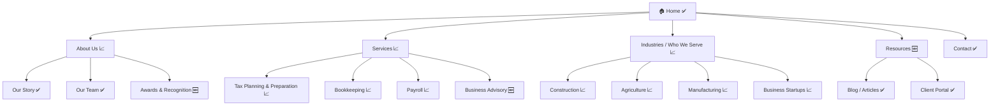

# CountingFive Site Audit Skill

## Overview

This skill takes a prospect's website URL, gathers data from multiple sources in parallel, scores the site across 7 dimensions, and produces a branded PDF report and a Markdown file. The output is a professional, client-facing sales document — persuasive and accessible, not overly technical.

**Output:** Three files saved to the workspace:
- `reports/audit-[domain]-[YYYY-MM-DD].html` — branded interactive HTML report
- `md/audit-[domain]-[YYYY-MM-DD].md` — Markdown version
- `mfp/mfp-[domain]-[YYYY-MM-DD].md` — Master Firm Profile

---

## Step 0: Setup — Read Config

Before doing anything else, read the config file and the scoring rubric:

```
Config:   [skill_dir]/config.json
Rubric:   [skill_dir]/references/scoring-rubric.md
API docs: [skill_dir]/references/api-calls.md
```

The `skill_dir` is the directory containing this SKILL.md file.

Extract from config:
- All API keys (firecrawl, pagespeed, google search)
- Firm brand settings
- Output directory paths
- Target industry keywords
- Workspace base path

If any required API key is missing or set to a placeholder value (`YOUR_*_HERE`), warn the user and offer to continue with degraded data for that section.

---

## Step 1: Parse the Target URL

From the user's message, extract the URL. Normalize it:
- Ensure it has `https://` prefix
- Extract the bare domain (e.g., `example.com`) for file naming and WHOIS lookup
- URL-encode it for API calls where needed

---

## Step 2: Dispatch Parallel Data-Gathering Agents

Launch all six agents simultaneously. Each agent should save its results as a JSON file in `/tmp/` so the synthesis step can read them.

Provide each agent with the exact API keys from config, the target URL, and clear instructions on what JSON to return. See `references/api-calls.md` for the exact curl commands.

---

### Agent A — Performance & Mobile (Google PageSpeed API)

**Goal:** Collect Core Web Vitals and performance metrics for both mobile and desktop.

**Instructions for Agent A:**
```
You are gathering performance data for a site audit.

Target URL: [URL]
PageSpeed API Key: [google_pagespeed_api_key from config]

Run two curl commands:
1. Mobile: https://www.googleapis.com/pagespeedonline/v5/runPagespeed?url=[URL_ENCODED]&key=[KEY]&strategy=mobile&category=performance&category=accessibility&category=seo
2. Desktop: https://www.googleapis.com/pagespeedonline/v5/runPagespeed?url=[URL_ENCODED]&key=[KEY]&strategy=desktop&category=performance&category=accessibility&category=seo

Save both responses. Then extract these values and save as /tmp/agent_a_results.json:
{
  "mobile_performance_score": (lighthouseResult.categories.performance.score * 100, rounded),
  "mobile_accessibility_score": (lighthouseResult.categories.accessibility.score * 100, rounded),
  "mobile_seo_score": (lighthouseResult.categories.seo.score * 100, rounded),
  "mobile_lcp": lighthouseResult.audits.largest-contentful-paint.displayValue,
  "mobile_cls": lighthouseResult.audits.cumulative-layout-shift.displayValue,
  "mobile_tbt": lighthouseResult.audits.total-blocking-time.displayValue,
  "mobile_viewport_pass": (lighthouseResult.audits.viewport.score == 1),
  "mobile_tap_targets_pass": (lighthouseResult.audits.tap-targets.score == 1),
  "mobile_font_size_pass": (lighthouseResult.audits.font-size.score == 1),
  "desktop_performance_score": (desktop lighthouseResult.categories.performance.score * 100),
  "desktop_lcp": desktop LCP displayValue,
  "desktop_cls": desktop CLS displayValue,
  "desktop_ttfb": lighthouseResult.audits.server-response-time.displayValue,
  "desktop_images_optimized": (lighthouseResult.audits.uses-optimized-images.score, 0-1),
  "desktop_render_blocking_count": (count of items in lighthouseResult.audits.render-blocking-resources.details.items, default 0),
  "raw_mobile_url": "[URL]",
  "error": null or error message if API call failed
}
```

---

### Agent B — Content, Structure & Tech Stack (Firecrawl)

**Goal:** Crawl the site to analyze content, SEO structure, and technology.

**Instructions for Agent B:**
```
You are crawling a website for a site audit.

Target URL: [URL]
Firecrawl API Key: [firecrawl_api_key from config]
Page limit: [firecrawl_page_limit from config, default 15]

1. First, scrape just the homepage using the Firecrawl /v1/scrape endpoint (see api-calls.md for exact curl command).
2. Then start a full crawl using /v1/crawl and poll until complete (or timeout after 60 seconds).
3. If crawl times out, work with homepage data only.

From the results, extract and save as /tmp/agent_b_results.json:
{
  "pages_crawled": (number of pages returned),
  "homepage_title": (the <title> tag text from homepage),
  "homepage_meta_description": (meta description from homepage),
  "h1_tags": [list of all H1 text found across crawled pages],
  "h2_tags": [sample of H2 tags, up to 10],
  "heading_structure_issues": (true/false — any pages with 0 or multiple H1s?),
  "schema_markup_found": (true/false — any <script type="application/ld+json"> present?),
  "schema_types": [list of @type values found in JSON-LD],
  "og_tags_present": (true/false — og:title, og:description, og:image found?),
  "sitemap_found": (true/false — <link rel="sitemap"> or /sitemap.xml referenced?),
  "sitemap_url": ("https://[domain]/sitemap.xml" if found, else null),
  "pages_list": [
    {
      "url": "full URL",
      "title": "page <title> tag text",
      "h1": "H1 text if found, else null",
      "confirmed": true (live page) or false (redirects to home or 404)
    }
  ],
  "robots_txt_signals": (any evidence of robots.txt in crawl?),
  "internal_link_count": (total internal links found),
  "external_link_count": (total external links found),
  "broken_link_count": (count of 404 or error links if detectable),
  "images_missing_alt_count": (count of  tags without alt attributes),
  "total_images_count": (total img tags found),
  "cms_detected": (WordPress, Squarespace, Wix, Webflow, custom, unknown),
  "page_builder_detected": (Divi, Elementor, Gutenberg, none, unknown),
  "ssl_present": (true/false — URL starts with https),
  "tech_stack_signals": [list of technology signals found in headers, script tags, meta tags],
  "main_body_text_sample": (first 500 words of homepage body text for keyword analysis),
  "copyright_year": (year found in footer copyright notice if present),
  "cta_texts": [list of call-to-action button/link texts found],
  "testimonials_found": (true/false),
  "certifications_found": (true/false — any credentials, certifications, professional memberships mentioned),
  "niche_keywords_found": [any accounting/tax/CPA specific terms found in content],
  "redirect_count": (number of pages that involved a redirect),
  "pages_with_no_title": (count),
  "pages_with_no_meta_desc": (count),
  "error": null or error message if crawl failed
}
```

---

### Agent C — Search Visibility (Serper.dev — Google Results)

**Goal:** Check how the site ranks for target keywords using real Google search results via Serper.

**Instructions for Agent C:**
```
You are checking search rankings for a site audit using Serper.dev (Google Search API).

Target URL: [URL]
Target Domain: [domain]
Serper API Key: [serper_api_key from config]
Keywords to check: [first 5 from config.target_industry.primary_keywords]
Location modifier: [config.target_industry.location_modifier if set, append to each query]

For each keyword, run this curl command:
  curl -s -X POST "https://google.serper.dev/search" \
    -H "X-API-KEY: SERPER_API_KEY" \
    -H "Content-Type: application/json" \
    -d '{"q": "KEYWORD", "num": 10}'

Results are in response.organic — an array of Google search results.
Check each result's .link field for the target domain.
Also check response.knowledgeGraph and response.answerBox for brand presence signals.

Save results as /tmp/agent_c_results.json:
{
  "keyword_results": [
    {
      "keyword": "the keyword searched",
      "position": (1-10 if found in top 10, null if not found),
      "found_in_top_10": true/false,
      "page_title_if_found": "the page title from search result",
      "competing_domains": [list of top 3 other domains in results]
    }
  ],
  "keywords_in_top_10": (count),
  "best_ranking_keyword": "keyword with best position or null",
  "best_position": (best position number found or null),
  "knowledge_graph_present": (true if site appears in knowledge panel),
  "error": null or error message if API call failed
}
```

---

### Agent D — Domain Age & Health (WHOIS)

**Goal:** Find domain age and registration details.

**Instructions for Agent D:**
```
You are looking up domain registration data for a site audit.

Target Domain: [domain]

Run: whois [domain]

Parse the output to find the creation/registration date.
Also check: https://archive.org/wayback/available?url=[domain] for earliest archive date as a backup.

Save as /tmp/agent_d_results.json:
{
  "domain": "[domain]",
  "registration_date": "YYYY-MM-DD or null if not found",
  "registrar": "registrar name if found",
  "domain_age_years": (float, calculated from registration_date to today),
  "domain_age_display": "X years, Y months",
  "expiry_date": "YYYY-MM-DD or null",
  "wayback_earliest": "YYYY-MM-DD or null",
  "error": null or error message
}
```

---

### Agent E — Niche & Services Intelligence (Firecrawl)

**Goal:** Deeply analyze niche clarity, per-service communication quality, and identify niche opportunities — both confirmed and invisible.

**Instructions for Agent E:**
```
You are analyzing a website's niche positioning and services communication for a site audit.

Target URL: [URL]
Firecrawl API Key: [firecrawl_api_key from config]
Niche Taxonomy: [skill_dir]/references/niche-taxonomy.md (read this file first)

Step 1 — Scrape targeted pages using Firecrawl /v1/scrape. Try each of these paths and use
whichever return content (not 404):
  - [URL]/services
  - [URL]/about
  - [URL]/about-us
  - [URL]/industries
  - [URL]/clients
  - [URL]/who-we-serve
  - [URL]/specialties
  - [URL]/solutions

Step 2 — Also reference the homepage (scrape [URL] if not already done by Agent B).

Step 3 — Using all collected content and the niche taxonomy, produce /tmp/agent_e_results.json:
{
  "niche_clarity_overall_score": (1-10 overall niche clarity score),
  "niche_sub_scores": {
    "niche_specific_language": (1-10 — industry vocabulary in headlines and body copy),
    "pain_points_in_headlines": (1-10 — pain points called out in H1s, H2s, above-fold copy),
    "outcome_framing": (1-10 — services described as client results vs. internal process),
    "niche_testimonials_social_proof": (1-10 — testimonials/cases from identifiable niche industries),
    "niche_specific_ctas": (1-10 — CTAs tailored to niche vs. generic),
    "visual_language_signals": (1-10 — alt text, image filenames, icon labels reflecting served industries)
  },
  "niches_detected": [
    {
      "niche": "niche name from taxonomy",
      "confidence": "confirmed" or "weak signal",
      "evidence": "one sentence: specific text or signal found"
    }
  ],
  "niches_invisible": [
    {
      "niche": "niche name",
      "rationale": "one sentence: why this is a natural opportunity for this firm"
    }
  ],
  "services_analysis": [
    {
      "service_name": "exact service name as listed on site",
      "clarity_to_non_accountant": "Clear" or "Moderate" or "Unclear",
      "framing": "Outcome-focused" or "Mixed" or "Process-focused",
      "audience": "Niche-specific" or "General",
      "rewrite_direction": "one sentence: what the copy should do differently"
    }
  ],
  "top_3_improvements": [
    "One-sentence description of highest-impact improvement",
    "One-sentence description of second improvement",
    "One-sentence description of third improvement"
  ],
  "pages_analyzed": [list of page URLs successfully scraped],
  "error": null or error message if all scrapes failed
}
```

---

### Agent F — Digital Intelligence (Serper + Firecrawl)

**Goal:** Research the firm and its key personnel across all public digital channels to build an external intelligence brief. This agent looks *outward* — at what the public internet says about the firm — rather than at the firm's own website.

**Important notes on data access:**
- LinkedIn and Twitter/X are not API-accessible. Use Serper search queries targeting those domains and extract signal from search snippets — do not attempt to scrape profile pages directly.
- Review platform pages (Yelp, BBB, Clutch, Google Business) *can* be scraped with Firecrawl once URLs are found via Serper.
- All research is based on publicly available information only.

**Instructions for Agent F:**
```
You are building a digital intelligence brief for a site audit.

Target URL: [URL]
Target Domain: [domain]
Target Firm Name: (extract from homepage title or About page — use your best inference)
Firecrawl API Key: [firecrawl_api_key from config]
Serper API Key: [serper_api_key from config]

STEP 1 — EXTRACT PERSONNEL NAMES
Scrape [URL]/about, [URL]/about-us, [URL]/team, [URL]/partners, [URL]/leadership
using Firecrawl /v1/scrape. Try all paths and use whichever return content.
Extract all named partners and key staff: full name, title, any credentials listed (CPA, EA, CFP, etc.).
If no names are found on these pages, note "Team page not found" and proceed with firm-level research only.

STEP 2 — PERSONNEL RESEARCH
For each named person, run these Serper searches:
  1. "[Full Name]" "[Firm Name]" site:linkedin.com
  2. "[Full Name]" CPA podcast OR interview OR speaker OR "published in"
  3. "[Full Name]" AICPA OR "[state] society of CPAs" OR accounting association

From each search, extract what is visible in snippets (title, credentials, niche mentions,
any article titles or podcast episode names). Do NOT attempt to scrape linkedin.com pages.
Check for a Twitter/X presence with: "[Full Name]" site:twitter.com OR site:x.com
Note follower range if visible in snippets, or "no public presence found."

STEP 3 — FIRM REPUTATION RESEARCH
Run these Serper searches:
  1. "[Firm Name]" reviews                     → find Google Business Profile, Yelp, BBB, Clutch URLs
  2. "[Firm Name]" site:yelp.com
  3. "[Firm Name]" site:bbb.org
  4. "[Firm Name]" "[City]" news OR press release OR award

For any review platform URLs found (Google Business, Yelp, BBB, Clutch),
scrape them with Firecrawl /v1/scrape to extract: rating, review count, recurring themes.
Extract up to 5 representative review snippets (praise and concerns).

STEP 4 — ASSOCIATIONS & AFFILIATIONS
Run: "[Firm Name]" AICPA OR "state CPA society" OR accounting association OR chamber
Also search per partner: "[Name]" AICPA OR board OR chapter OR committee

STEP 5 — CONTENT FOOTPRINT
Run: "[Firm Name]" podcast OR webinar OR article OR "authored by" OR "featured in"
Run: "[Firm Name]" site:youtube.com

Note any articles, blog posts (external to their own site), podcast episodes, webinars,
speaking engagements, or press quotes found.

STEP 6 — SOCIAL ACCOUNTS
Run: "[Firm Name]" site:linkedin.com/company
Run: "[Firm Name]" site:facebook.com
Run: "[Firm Name]" site:instagram.com
Note any found accounts: platform, approximate follower count (if visible), post frequency signals.

Save all results as /tmp/agent_f_results.json:
{
  "firm_name_detected": "name extracted from site or search results",
  "firm_city": "city detected from site or search",
  "personnel": [
    {
      "name": "Full Name",
      "title": "title as listed on site",
      "credentials": ["CPA", "EA", etc.],
      "linkedin_signals": "one sentence: what LinkedIn search snippets reveal about their background/niche focus",
      "twitter_presence": "active / minimal / none",
      "associations_found": ["AICPA", "TSCPA", etc.],
      "content_found": ["Podcast name/episode title", "Article title", etc.],
      "niche_signals": ["real estate", "dental", etc. — inferred from external sources only],
      "footprint_strength": "strong / moderate / minimal",
      "summary": "one paragraph: credentials, niche focus signals, public reputation, footprint strength"
    }
  ],
  "reputation_signals": {
    "google_business_rating": (float or null),
    "google_review_count": (int or null),
    "yelp_rating": (float or null),
    "bbb_rating": (string or null),
    "clutch_rating": (float or null),
    "praise_themes": ["responsive", "tax expertise", etc.],
    "concern_themes": ["slow response times", etc.] or [],
    "representative_reviews": ["review snippet 1", "review snippet 2"],
    "overall_sentiment": "positive / mixed / negative / not found"
  },
  "associations": [
    {
      "name": "Association name",
      "evidence": "one sentence: how the connection was found"
    }
  ],
  "content_footprint": [
    {
      "type": "podcast / article / webinar / press / award / video",
      "title": "title or description",
      "source": "publication or platform name",
      "niche_relevance": "which niche this relates to, or 'general'"
    }
  ],
  "social_accounts": [
    {
      "platform": "LinkedIn / Facebook / Instagram",
      "url": "URL if found",
      "followers_approx": "number or range or null",
      "activity_level": "active / low / dormant / not found"
    }
  ],
  "press_mentions": ["brief description of any news mentions found"],
  "niche_gap_analysis": {
    "external_niches_found": ["niches found via external research that are NOT on the website"],
    "website_niches": ["(populated from Agent E results — leave as empty array, synthesized in Step 4)"],
    "unleveraged_credibility": ["one-sentence description of each gap between external niche signals and website messaging"],
    "gap_summary": "two to three sentences: overall assessment of the gap between external credibility and website presence"
  },
  "error": null or error message
}
```

---

## Step 3: Collect Agent Results

After all agents complete, read their output JSON files:
- `/tmp/agent_a_results.json` — performance data
- `/tmp/agent_b_results.json` — content/structure data
- `/tmp/agent_c_results.json` — ranking data
- `/tmp/agent_d_results.json` — domain data
- `/tmp/agent_e_results.json` — niche & services intelligence
- `/tmp/agent_f_results.json` — digital intelligence brief

If any file is missing or contains an error, note the issue and proceed with available data.

**Cross-agent synthesis — niche gap analysis:**
Before moving to Step 4, populate `agent_f_results.niche_gap_analysis.website_niches` using
the `niches_detected` array from `agent_e_results.json`. This is the only cross-agent dependency.
If Agent E results are unavailable, leave `website_niches` as an empty array.

---

## Step 4: Score All Sections

Using the scoring rubric in `references/scoring-rubric.md`, convert raw data into sub-scores (1–10) and letter grades.

For each sub-score, reference the rubric's thresholds. Use your judgment for any data points not perfectly matching a rubric threshold — err toward the more generous score if the data is ambiguous.

Build a scoring object:

```json
{
  "url": "[URL]",
  "domain": "[domain]",
  "audit_date": "[YYYY-MM-DD]",
  "overall_grade": "[letter grade]",
  "overall_score": [average of 7 section averages, 1 decimal],
  "executive_summary": "[3–4 sentences: most critical findings, biggest opportunities, overall assessment]",
  "sections": {
    "mobile_responsiveness": {
      "grade": "[letter]",
      "average_score": [1 decimal],
      "sub_scores": {
        "mobile_performance": [score],
        "viewport_configuration": [score],
        "touch_targets": [score],
        "text_readability": [score],
        "lcp_mobile": [score],
        "cls_mobile": [score]
      },
      "narrative": "[3–5 sentences: what this measures, what we found, why it matters to the client. Plain language, no jargon.]"
    },
    "site_speed": { ... },
    "seo_health": { ... },
    "target_market_clarity": { ... },
    "niche_intelligence": {
      "grade": "[letter]",
      "average_score": [1 decimal, average of 6 niche sub-scores],
      "sub_scores": {
        "niche_specific_language": [score],
        "pain_points_in_headlines": [score],
        "outcome_framing": [score],
        "niche_testimonials_social_proof": [score],
        "niche_specific_ctas": [score],
        "visual_language_signals": [score]
      },
      "narrative": "[3–5 sentences: overall niche clarity assessment, what's strongest, what's missing, business impact. Plain language.]",
      "services_analysis": [
        {
          "service_name": "[service name]",
          "clarity_to_non_accountant": "Clear / Moderate / Unclear",
          "framing": "Outcome-focused / Mixed / Process-focused",
          "audience": "Niche-specific / General",
          "rewrite_direction": "[one sentence]"
        }
      ],
      "niches_detected": [
        { "niche": "[name]", "confidence": "confirmed / weak signal", "evidence": "[one sentence]" }
      ],
      "niches_invisible": [
        { "niche": "[name]", "rationale": "[one sentence]" }
      ],
      "top_3_improvements": ["[improvement 1]", "[improvement 2]", "[improvement 3]"]
    },
    "competitive_visibility": { ... },
    "technology_stack": { ... },
    "site_health": { ... }
  },
  "recommendations": [
    {
      "priority": "High",
      "issue": "[Issue name]",
      "section": "[Which section it came from]",
      "impact": "[One sentence: what this costs the firm in lost business or visibility]",
      "countingfive_service": "[One sentence: how CountingFive specifically addresses this]"
    }
  ]
}
```

**Narrative writing guidelines:**
- Write for a business owner who is not a web developer
- Lead with what you found ("Your site scored X on mobile performance...")
- Explain why it matters in business terms ("This means potential clients on phones...")
- Avoid technical jargon unless immediately explained
- Keep each narrative to 3–5 sentences
- Tone: professional, honest, constructive — never condescending

**Recommendations:**
- Pick the top 3–5 most impactful findings across all sections
- Rank by business impact: revenue/visibility loss > credibility/trust > technical debt
- Map each recommendation to a specific CountingFive service (web redesign, hosting upgrade, content strategy, SEO, etc.)
- Prioritize as High / Medium / Low

Add the digital intelligence brief as a top-level key alongside `sections` (it is not scored and does not affect the overall grade):

```json
{
  "url": "...",
  "domain": "...",
  "audit_date": "...",
  "overall_grade": "...",
  "overall_score": "...",
  "executive_summary": "...",
  "sections": { ... },
  "recommendations": [...],
  "intelligence_brief": {
    "firm_name_detected": "...",
    "firm_city": "...",
    "personnel": [ ... ],
    "reputation_signals": { ... },
    "associations": [ ... ],
    "content_footprint": [ ... ],
    "social_accounts": [ ... ],
    "press_mentions": [ ... ],
    "niche_gap_analysis": {
      "external_niches_found": [ ... ],
      "website_niches": [ ... ],
      "unleveraged_credibility": [ ... ],
      "gap_summary": "..."
    }
  }
}
```

The `intelligence_brief` is populated directly from `/tmp/agent_f_results.json` with the `website_niches` field filled from Agent E results.

Save the complete object to `/tmp/audit_results.json`.

---

## Step 5: Generate Audit Reports

Run the report generation script. Note: the MFP is generated separately in Step 6 — do NOT pass `--output-mfp` here.

```bash
python3 [skill_dir]/scripts/generate_report.py \
  --data /tmp/audit_results.json \
  --config [skill_dir]/config.json \
  --output-html [workspace_base]/reports/audit-[domain]-[YYYY-MM-DD].html \
  --output-md [workspace_base]/md/audit-[domain]-[YYYY-MM-DD].md
```

Where:
- `[skill_dir]` = directory containing this SKILL.md
- `[workspace_base]` = `output.workspace_base` from config.json
- `[domain]` = bare domain with dots replaced by hyphens (e.g., `example-com`)
- `[YYYY-MM-DD]` = today's date

This produces two files:
- `reports/audit-[domain]-[date].html` — branded interactive HTML report (self-contained, print-ready) **DO NOT MODIFY THIS OUTPUT**
- `md/audit-[domain]-[date].md` — Markdown version of the full audit

---

## Step 6: Generate Proposed Master Firm Profile (MFP)

The MFP is a strategic dossier about the client firm — richer and more research-backed than the audit. It feeds a client review session and ultimately drives content strategy and site content generation for the rebuild. It is labeled **Proposed MFP** throughout because the client will confirm, edit, or delete individual items in a subsequent interactive step.

**Do NOT use `generate_report.py` for the MFP.** Follow this agentic research-and-synthesis workflow instead.

> **What to include from the audit:** executive_summary (narrative), target_market_clarity, competitive_visibility, niche_intelligence, intelligence_brief.
> **What to exclude from the MFP:** site_speed, mobile_responsiveness, technology_stack, seo_health, site_health. These are technical audit findings only — they are not relevant to the MFP because we assume we will be rebuilding the site.

---

### 6A — Location & Contact Research

Search for and fetch the following to find address, phone, email, hours per location:

1. Search: `"[Firm Name]" address phone hours [city]`
2. Search: `"[Firm Name]" Google Business Profile`
3. Fetch `[URL]/contact` and `[URL]/contact-us` with Firecrawl
4. Scrape any Yelp or Google Business listing URLs found
5. Look for multiple office locations — capture each separately

Collect: street address, city, state, zip, phone, fax (if present), email, business hours, whether hours vary by location.

---

### 6B — History & Establishment Research

1. Fetch `[URL]/about` and `[URL]/about-us` with Firecrawl (may already be cached from Agent E — reuse if so)
2. Search: `"[Firm Name]" founded established history`
3. If the firm's name has changed over time (e.g., a founding partner's name was previously in the name), search for the original name too
4. Look for: founding year, founding partners, key milestones, firm heritage narrative, name changes

---

### 6C — Deep Team Research

For every person in `intelligence_brief.personnel`, run ALL of the following searches. Extract information from search snippets only — do NOT attempt to scrape linkedin.com pages directly.

For each person:
1. `"[Full Name]" "[Firm Name]" site:linkedin.com` → previous employers, title, specializations
2. `"[Full Name]" CPA [city] specialization OR niche OR "areas of expertise"`
3. `"[Full Name]" AICPA OR "[State] Society of CPAs" OR accounting committee OR board
4. `"[Full Name]" speaker OR podcast OR "published" OR article OR webinar OR "authored"
5. `"[Full Name]" CPA site:cpas.org OR site:aicpa.org` (or state CPA society site)
6. Search for any CPA directory listing for that person

From each search, compile:
- Previous employers and roles held
- Stated areas of specialization or niche focus
- Education and additional certifications beyond what's on the firm's site
- Published content or speaking appearances
- Any client types or industries mentioned

**Team Expertise Cross-Reference:** After researching all team members, compare each person's identified expertise areas against:
1. The firm's confirmed niches (from `niche_intelligence.niches_detected`)
2. The firm's confirmed services (from `niche_intelligence.services_analysis`)

For any expertise area that is NOT currently reflected in a service page or niche page but has clear market demand, flag it as a leverage opportunity in this exact format:

```
**[Person Name]** has expertise in **[specific area]** → Unleveraged [Service / Audience]: **[specific opportunity]**
*Opportunity: [one sentence on why this audience/service is viable for this firm]*
```

---

### 6D — Additional Social & Digital Research

1. Search: `"[Firm Name]" site:youtube.com` → any video content or channel?
2. Search: `"[Firm Name]" site:yelp.com` → scrape for address, hours, additional reviews
3. Confirm all social URLs from Agent F are still valid; note follower counts if visible in snippets
4. Check if the firm has any newsletter, podcast series, or webinar program

---

### 6E — Positioning Extraction

From Agent B's `main_body_text_sample` or by re-fetching the homepage:
- Extract the exact tagline or value proposition (quote it verbatim)
- Extract any "why us" or "our difference" copy
- Note the primary CTA text
These become the **Current Positioning** block in the MFP.

---

### 6F — Local Competitor Snapshot

Research 4–7 competing CPA firms within the firm's competitive radius (typically 30–40 miles; include the nearest metro if applicable). This shapes the positioning conversation and the content strategy.

**Search queries to run:**
1. `CPA firm [city] [state] [primary niche]` — e.g., `CPA firm Barry County Michigan agriculture`
2. `accounting firm [county/region] construction OR manufacturing`
3. `CPA [city] small business` — to surface any direct local competitors
4. Visit the top 4–6 results and note: tagline, industries claimed, awards displayed, approximate firm size

**For each competitor, capture:**

```json
{
  "firm_name": "",
  "location": "",
  "url": "",
  "tagline": "",
  "industries_claimed": [],
  "agriculture_claimed": true/false,
  "construction_claimed": true/false,
  "size_signal": "solo / small / mid-size / regional / large",
  "notable_credentials": [],
  "positioning_notes": ""
}
```

Save to `/tmp/competitor_research.json`.

**Synthesis to produce for the MFP:**
- Which niches are **commoditized** (claimed by 3+ competitors) vs. **defensible** (claimed by 0–1)?
- What is the firm's **clearest competitive moat** given what competitors are and are not claiming?
- Are there any **recent competitive developments** (mergers, new entrants) worth flagging for the client?
- End with a short "Competitive Takeaways" block that the client can react to in the review session

This goes into the MFP as a "Competitive Context" subsection within Section 2, immediately after the Proposed Positioning block.

---

### 6G — Synthesis: Content Gap Analysis

Categorize all gaps identified across all research into four buckets:

**Niche Gaps** — Industries or audiences the firm has credibility to serve but has no web presence for.
**Authority Gaps** — Awards, credentials, partner pedigree, tenure, or media appearances not visible on the site.
**Conversion Gaps** — Missing testimonials, weak CTAs, absent social proof, unoptimized Google Business Profile.
**Team Expertise Gaps** — Specific capabilities identified in 6C that are not currently marketed (from the cross-reference above).

---

### 6H — Synthesis: Proposed Positioning

Write two positioning blocks:

**Current Positioning:** Synthesize from the site's actual copy — tagline, value prop, what the homepage currently says about who they are and what they do. Quote directly where possible.

**Proposed Positioning — Three Options:** Write three positioning framings, each leading with a different emphasis but grounded in the same underlying differentiators. Typical angles:
- **Option A:** Leads with the firm's most distinctive credential (Big 4 pedigree, rare niche specialization, award)
- **Option B:** Leads with tenure, community trust, and long-term relationships
- **Option C:** Leads with the combination of enterprise expertise and local personal service

The client selects one (or blends) in the review session. Presenting options prevents positioning conversations from stalling on a single statement.

End each option with the evidence it's grounded in (awards, tenure, team background, niche credibility).

---

### 6I — Synthesis: Proposed Site Map

Read `[skill_dir]/references/mfp-sitemap-guide.md` for generation rules before building the sitemap.

(This step was previously 6H — renumbered to accommodate new steps 6F and 6I above.)

Build a sitemap tailored to this firm's confirmed services, identified niches, team structure, and gap analysis. Annotate each page with one of:
- ✅ = supported by current content (needs polishing, not net-new)
- 🆕 = new page that addresses an identified gap
- 📈 = existing page that needs significant depth improvement

Render the sitemap as a **Mermaid diagram** (renders natively in Obsidian) followed by an **indented text tree** for easy reading. Both appear in the MFP `.md` file — no separate file needed.

---

### 6I — Industry Sub-Category Evaluation

For each industry the firm is **confirmed to serve** (from `niche_intelligence.niches_detected`), evaluate the firm against the standard sub-categories for that industry. Use site copy, Agent E's niche analysis, Agent F's digital intelligence, and any Firecrawl page content already gathered to assign a status to each sub-category.

**Status key:**
- ✅ **Confirmed on site** — explicitly described in site copy (direct quote or page section found)
- 🔍 **Likely offered** — strong inference from firm's niche + service mix, but not stated explicitly
- ❓ **Verify in review** — cannot determine from available information; flag for client confirmation

**How to evaluate:** For each sub-category, search the already-gathered site content first. If not found, do a quick search: `"[Firm Name]" "[sub-category term]"` or check the firm's industry page via Firecrawl. If still unresolved, mark ❓.

**Only include tables for industries the firm actually serves. Skip all others.**

**Master Industry Sub-Category List:**

---

**Construction**
| Sub-Category | Status | Notes |
|---|---|---|
| Job Costing & Profitability | | Track costs by project in real time |
| Cash Flow Management | | Forecasting based on project timelines |
| Progress Billing & AR | | Invoicing, change orders, retainage collection |
| Strategic Growth Planning | | Capacity analysis before bidding larger projects |
| Tax Planning | | Construction-specific deductions and entity structuring |

**Automotive Service**
| Sub-Category | Status | Notes |
|---|---|---|
| Revenue Management & Forecasting | | Shop revenue modeling by service line |
| Technician Utilization Rate Analysis | | Labor efficiency and billable hours tracking |
| Vendor Cost Analysis | | Parts and supply cost benchmarking |
| Gross Profit Analysis | | Per-job and department-level margin visibility |
| Labor Cost-to-Revenue Percentage Analysis | | Compensation ratio benchmarking |

**Medical Professionals**
| Sub-Category | Status | Notes |
|---|---|---|
| AR Management & Collections | | Insurance billing cycles, denial management |
| Overhead Cost Analysis | | Cost per patient, facility cost structure |
| Provider Compensation Models | | Physician/partner comp structures and equity |
| Practice Profitability & Growth | | Expansion modeling, new provider ROI |
| Compliance & Reporting | | Healthcare-specific financial reporting requirements |

**Professional Services**
| Sub-Category | Status | Notes |
|---|---|---|
| Client & Project Profitability | | Per-engagement margin tracking |
| Project Tracking & Scope Control | | Budget vs. actual by engagement |
| Utilization & Productivity Tracking | | Billable hours efficiency |
| Rate Analysis & Pricing Strategy | | Market rate benchmarking |
| Partner Compensation & Growth | | Equity, draws, and partner economics |

**Service Businesses**
| Sub-Category | Status | Notes |
|---|---|---|
| Job Profitability Tracking | | Per-job cost and margin visibility |
| Team Productivity & Efficiency | | Labor cost and output ratios |
| Materials & Inventory Management | | Supplies and consumables cost control |
| Recurring Revenue & Service Contracts | | MRR tracking and contract accounting |
| Growth & Capacity Planning | | Headcount and capacity expansion modeling |

**Agriculture**
| Sub-Category | Status | Notes |
|---|---|---|
| Farm Cash Flow & Seasonal Planning | | Revenue/expense modeling across planting, growing, and harvest cycles |
| Crop & Livestock Basis Tracking | | Cash price vs. futures basis management for grain and livestock producers |
| FSA/USDA Compliance & Reporting | | Farm Service Agency loan compliance, CRP contracts, USDA payment filings |
| Equipment Depreciation & Cost Recovery | | Section 179, bonus depreciation, and farm equipment cost recovery strategy |
| Farm Succession & Estate Planning | | Generational ownership transitions, buy-sell agreements, estate tax planning |

**Manufacturing**
| Sub-Category | Status | Notes |
|---|---|---|
| Job Costing & Work-in-Process (WIP) Tracking | | Cost allocation by production run and order |
| Inventory Valuation & COGS Analysis | | FIFO, LIFO, weighted average — margin and cost visibility |
| Overhead Allocation & Variance Analysis | | Standard costing, overhead rates, and variance reporting |
| Cash Flow & Working Capital Management | | Receivables, payables, and inventory cycle management |
| Growth & Capacity Planning | | Capital investment analysis, equipment financing, expansion modeling |

**Business Startups**
| Sub-Category | Status | Notes |
|---|---|---|
| Entity Formation & Structure | | LLC, S-Corp, C-Corp analysis and optimal entity selection |
| Chart of Accounts & Accounting System Setup | | Bookkeeping infrastructure from day one |
| Payroll Setup & Compliance | | First hires, payroll taxes, and benefits structure |
| Cash Runway & Burn Rate Planning | | Startup cash modeling and runway projections |
| Investor/Lender Financial Preparation | | Projections, reviewed financials, and due diligence support |

---

The completed tables (with status filled in) go into Section 5 of the MFP, between the "Identified Industries" table and the "Team-Derived Audience Opportunities" section, under a heading:

```
### Industry Sub-Category Assessment
*Status key: ✅ Confirmed on site | 🔍 Likely offered | ❓ Verify in client review*
```

---

### 6J — Current Site Map & Redirect Planning

Before writing the MFP, capture the firm's current URL structure for redirect planning during the site rebuild.

**Step 1 — Get URL list:**
- Check if Agent B's results (`/tmp/agent_b_results.json` or `audit_results.json`) include a `pages_list` field. If yes, use it.
- If not, try fetching `[URL]/sitemap.xml` directly. Parse all `<loc>` entries.
- As a fallback, use Firecrawl `/v1/crawl` to discover pages.

**Step 2 — Verify each URL:**
For each URL found, check if it loads as a live page or redirects to the homepage. A page that returns the homepage title is effectively a redirect (not a live distinct page).

**Step 3 — Build redirect planning table:**
Map each current live URL to its closest proposed equivalent:
- **No change** — URL stays the same on the new site
- **301 Redirect** — page is moving to a new URL (old → new)
- **Consolidate** — page content merges into another page (list destination)
- **New page** — proposed page with no current equivalent (no redirect needed; note as new content required)

This section goes into the MFP as **Section 10A — Current Site Map** immediately before the proposed site map (which becomes **Section 10B**).

**Format for Section 10A in the MFP:**

```markdown
## Section 10A — Current Site Map

*[N] live pages confirmed from sitemap/crawl as of [date].*
*This map is used to plan 301 redirects when the new site launches.*

| Current URL | Page Title | Status |
|---|---|---|
| /path | Page Title | Live |
| /old-path | Old Title | → redirects to /new-path |

### Redirect Planning Table

| Current URL | Current Page | Action | New URL |
|---|---|---|---|
| /current-path | Page Title | 301 Redirect | /new-path |
| /current-path | Page Title | No Change | /same-path |
| /current-path | Page Title | Consolidate | → /destination |
| *(no current URL)* | *(n/a)* | New Page | /new-path |
```

---

### 6K — Write the MFP File

Write the complete Proposed MFP to `[workspace_base]/mfp/mfp-[domain]-[YYYY-MM-DD].md` using this exact structure:

```markdown
# Proposed Master Firm Profile: [Firm Name]
<!-- CountingFive — Proposed MFP: pending client review and confirmation -->
<!-- Client review step: confirm, edit, or delete individual items before finalizing -->
<!-- Source audit: [domain] dated [YYYY-MM-DD] -->

---

## Section 1 — Firm Identity

| Field | Value |
|-------|-------|
| **Domain** | [domain] |
| **URL** | [URL] |
| **Firm Name** | [detected name or *(not found)*] |
| **Year Established** | [year or *(not found)*] |
| **Firm Size Estimate** | [X–Y staff or *(not found)*] |
| **MFP Date** | [YYYY-MM-DD] |
| **Prepared By** | CountingFive |

### Location(s)

<!-- Repeat this block for each location found -->

**[Location Name / Primary Office]**

| Field | Value |
|-------|-------|
| **Address** | [full address or *(not found)*] |
| **Phone** | [phone or *(not found)*] |
| **Email** | [email or *(not found)*] |
| **Business Hours** | [hours or *(not found)*] |

---

## Section 2 — Firm Narrative

### History & Background
[2–4 sentences: founding story, significant milestones, name history, tenure. Sourced from site copy and web research.]

### Current Positioning
> "[Exact tagline or value proposition pulled from the site — quote it verbatim]"

[1–2 sentences: what the site currently says about who they are and why clients should choose them.]

### Proposed Positioning

Three framings — each built on the same differentiators but leading with a different emphasis. Client selects one in the review session.

> **Option A — [Label: primary differentiator angle]**
> [2–4 sentences leading with the firm's most distinctive credential or niche claim]

> **Option B — [Label: tenure/trust angle]**
> [2–4 sentences leading with operating history, community roots, long-term relationships]

> **Option C — [Label: expertise + local combination]**
> [2–4 sentences leading with the combination of enterprise-level credentials and personal local service]

*All three grounded in: [brief list of evidence — awards, credentials, tenure, niche signals]*

> 📋 **Client Review Action:** Select preferred positioning option (A, B, or C) or note which elements to blend. This becomes the foundation of homepage copy, service page intros, and Google Business Profile description.

### Competitive Context

| Firm | Location | Size | [Primary Niche] Claimed | Positioning Notes |
|---|---|---|---|---|
| [Firm Name] | [Location] | [Size signal] | ✅ / ❌ | [one sentence] |

**Key Competitive Takeaways:**
- [Which niches are commoditized vs. defensible]
- [Firm's clearest competitive moat]
- [Any recent competitive developments — mergers, new entrants]

> 📋 **Client Review Action:** Confirm competitor list. Are there others we should know about? Any competitive developments already affecting client conversations?

---

## Section 3 — Accreditations, Awards & Affiliations

| Organization | Type | Evidence |
|---|---|---|
| [Org Name] | [Membership / Award / Certification] | [one sentence: source of the connection] |

---

## Section 4 — Social & Digital Footprint

| Platform | URL | Followers | Activity | Notes |
|---|---|---|---|---|
| [Platform] | [URL or *(not found)*] | [count or *(unknown)*] | [Active / Low / Dormant / Not Found] | [optional] |

**Google Business Profile:** [URL if found, or *(not found)*]
**Review Summary:** [rating, review count, dominant themes — 1 sentence]

---

## Section 5 — Who They Serve

*Source: Audit target market analysis + team expertise cross-reference (Step 6C)*

### Confirmed Target Markets

[Narrative paragraph from the audit's target_market_clarity section — client-relevant language only, no scores]

**Identified Industries:**

| Industry | Confidence | Evidence |
|---|---|---|
| [Industry] | Confirmed / Weak Signal | [one sentence] |

### Ideal Client Profile (ICP)
*Draft one ICP per confirmed industry. Base on audit data, team expertise research, and industry knowledge. Client confirms/corrects/adjusts in the review session.*

> 📋 **Client Review Action:** For each ICP, mark ✅ Accurate | ✏️ Adjust (note changes) | ❌ Remove. Add typical revenue size, how clients find you, and what makes a great client vs. a difficult one.

<!-- Repeat the ICP block below for each confirmed industry -->

**[Industry Name] ICP**
*[One-sentence description of who this client is]*

- **Business type:** [types of businesses in this niche]
- **Size range:** [revenue range or employees or acreage/operation size]
- **Stage:** [growth stage, ownership generation, phase of business]
- **What triggers a search:** [the 2–3 events that make them look for a new CPA]
- **What they fear:** [primary financial/compliance anxieties]
- **What they value:** [what makes a CPA relationship work for them]
- **Ideal signal:** *"[A quote that sounds like their first call or email]"*

---

### Industry Sub-Category Assessment
*Evaluates each served industry against known accounting sub-specializations. Sourced from site copy, niche analysis, and digital intelligence.*
*Status key: ✅ Confirmed on site — explicitly in copy | 🔍 Likely offered — strong inference | ❓ Verify in client review*

<!-- Repeat the block below for each confirmed industry. Use the master list from Step 6I. -->
**[Industry Name]**

| Sub-Category | Status | Notes |
|---|---|---|
| [Sub-Category] | ✅ / 🔍 / ❓ | [one sentence: source of status or what to confirm] |

---

### Team-Derived Audience Opportunities
*These audiences are not currently marketed to, but team expertise supports serving them:*

- **[Person Name]** has expertise in **[X]** → Unleveraged audience: **[Y]**
  *Opportunity: [one sentence on viability]*

---

## Section 6 — Services Inventory

*Source: Audit niche & services intelligence + team expertise cross-reference (Step 6C)*

**Niche Clarity Score:** [score]/10 | **Grade:** [grade]

### Confirmed Services

| Service | Clarity | Current Framing | Rewrite Direction |
|---|---|---|---|
| [Service] | [Clear / Moderate / Unclear] | [Outcome / Process / Mixed] | [one sentence] |

<!-- If the firm has a named/branded advisory product (e.g., BOSS, CFO-on-Call, etc.), add the block below -->
> 📋 **Client Review Required — [Product Name] Details**
> This advisory product is featured prominently on the site. The content strategy for the advisory page depends on these details — please bring to the review session:
> - What does [Product Name] stand for (if acronym)?
> - What is specifically included in the engagement?
> - Who is the ideal client? (revenue size, industry, stage)
> - Current pricing structure?
> - Approximately how many active clients are enrolled?
> - Any specific client outcomes you're proud of? (before/after, decisions made, dollar impact)

---

### High-Opportunity Niches (Currently Invisible)

| Niche | Rationale |
|---|---|
| [Niche] | [one sentence: why this firm could serve this audience] |

### Team-Derived Service Opportunities
*These services are not currently on the site but are supported by team expertise:*

- **[Person Name]** has expertise in **[X]** → Unleveraged service: **[Y]**
  *Market case: [one sentence on viability]*

---

## Section 7 — Team & Credentials

<!-- One sub-section per team member -->

### [Full Name], [Credentials]
**Title:** [title as listed on site]
**External Footprint:** [Strong / Moderate / Minimal]

| Attribute | Detail |
|---|---|
| **Credentials** | [CPA, MSA, EA, etc.] |
| **Previous Employers** | [list or *(not found)*] |
| **Areas of Expertise** | [list from research] |
| **Niche Signals** | [list — industries or client types mentioned externally] |
| **Associations** | [list or *(none found)*] |
| **Published / Speaking** | [list or *(none found)*] |

**Bio Summary:** [1–2 sentences: synthesized from audit and deep research]

**Leverage Opportunities:**
- [Specific expertise not on site → specific opportunity]
- [Additional opportunity if applicable, otherwise omit this line]

---

## Section 8 — Reputation & Trust Signals

**Overall Sentiment:** [positive / mixed / negative / not found]
**Google Rating:** ★ [X.X] ([N] reviews) — or *(not found)*
**Yelp Rating:** ★ [X.X] ([N] reviews) — or *(not found)*
**BBB Status:** [accredited / not accredited / not found]

### Review Themes
**Praise:** [comma-separated themes]
**Concerns:** [comma-separated themes, or *(none noted)*]

### Press & Media
- [item — title, publication, date if known]

### Trust Signal Gaps
*Elements that exist externally but are missing from the website:*
- [Gap — e.g., "No on-site testimonials despite positive Google reviews and verified 8+ year client relationships"]
- [Additional gap]

---

## Section 9 — Content Gap Analysis

### Niche Gaps
*Audiences or industries the firm has credibility to serve but has zero web presence for:*
- **[Niche]** — [one sentence: what credibility exists and why this is an opportunity]

### Authority Gaps
*Credentials, awards, pedigree, and tenure that are not visible on the site:*
- **[Gap]** — [one sentence: what's missing, where it should appear, why it matters]

### Conversion Gaps
*Missing elements that would help website visitors become clients:*
- **[Gap]** — [one sentence: what's missing and the business impact]

### Team Expertise Gaps
*Capabilities the firm has but doesn't market — from Sections 5, 6, and 7:*
- **[Gap]** — [person, expertise area, specific missed opportunity]

---

## Section 10A — Current Site Map

*[N] live pages confirmed from sitemap/crawl as of [date]. Used for redirect planning during site rebuild.*

| Current URL | Page Title | Status |
|---|---|---|
| / | Home | Live |
| /[path] | [Title] | Live |
| /[old-path] | [Title] | → redirects to [destination] |

### Redirect Planning Table

*Developers: implement these as 301 redirects before or immediately at launch.*

| Current URL | Current Page | Action | New URL |
|---|---|---|---|
| /[current] | [Title] | 301 Redirect | /[new-path] |
| /[current] | [Title] | No Change | /[same-path] |
| /[current] | [Title] | Consolidate | → /[destination] |
| *(no current URL)* | *(n/a — new content)* | New Page | /[new-path] |

---

## Section 10B — Proposed Site Map

*Tailored to [Firm Name]'s confirmed services, identified niches, team structure, and content gap analysis.*
*Annotation key: ✅ existing content (needs polishing) · 🆕 new page (addresses a gap) · 📈 exists but needs major depth improvement*


<!-- IMPORTANT: Replace the example above with a sitemap actually tailored to this firm.
     Add pages for team-derived service opportunities and niche gaps identified in Section 9.
     Remove any pages that don't apply. Add industry-specific pages for any confirmed niches.
     See references/mfp-sitemap-guide.md for full generation rules. -->

**Site Map — Text Tree**

```
Home ✅
├── About Us 📈
│   ├── Our Story ✅
│   ├── Our Team ✅
│   └── Awards & Recognition 🆕
├── Services 📈
│   ├── Tax Planning & Preparation 📈
│   ├── Bookkeeping 📈
│   ├── Payroll 📈
│   └── Business Advisory 🆕
├── Industries / Who We Serve 📈
│   ├── Construction 📈
│   ├── Agriculture 📈
│   ├── Manufacturing 📈
│   └── Business Startups 📈
├── Resources 🆕
│   ├── Blog / Articles ✅
│   └── Client Portal ✅
└── Contact ✅
```
<!-- Replace with firm-specific tree matching the Mermaid diagram above -->

---

## Section 11 — Before You Review

*Read this before your MFP review session. Most items just need a "yes / correct / delete." The items below are what we cannot research — gathering them in advance keeps the session on strategy.*

### What to Have Ready

**About the firm:**
- [ ] Any corrections to firm history, staff count, titles, or credentials in Section 7
- [ ] Any awards, certifications, or memberships missing from Section 3

**About [named advisory product, if applicable]:**
- [ ] What is specifically included in the engagement
- [ ] Ideal client profile (size, industry, stage)
- [ ] Current pricing structure
- [ ] Number of active clients enrolled
- [ ] 1–2 specific client outcomes you're proud of (before/after, dollar impact, decision made)

**About your clients:**
- [ ] Rough breakdown of your current book by industry (e.g., "~40% ag, ~30% construction")
- [ ] Typical client revenue size for each industry you serve
- [ ] How clients most commonly find you (referral, Google, association, etc.)
- [ ] 2–3 specific client success stories — one per industry if possible. Format: *"Client type, situation they came to us with, what we did, what the outcome was."* These become case study copy on industry pages.

**About the new services and niches we've flagged:**
- [ ] For each item in "High-Opportunity Niches" (Section 6): do you currently offer it, or would you need to build it? (yes / not yet / maybe)
- [ ] For sub-category items marked ❓ in Section 5: quick yes/no on whether you offer each one

**About your competitive landscape:**
- [ ] Any corrections or additions to the competitor list in Section 2
- [ ] Any recent competitive developments you're aware of?

**Visual and content assets:**
- [ ] Professional headshots: which team members have them?
- [ ] Any industry-specific photos (farm/field imagery, job sites, shop floor, etc.)?
- [ ] Office photos?
- [ ] Existing videos beyond any award announcements?
- [ ] Any existing blog articles worth keeping or repurposing?

### What We'll Decide Together in the Session

1. Which positioning option resonates — or what to blend
2. Which invisible services and niches to actively add to the new site
3. Final sitemap — which proposed pages to build, which to defer
4. Content priorities — what gets written first

---

## Section 12 — Pipeline Tracker

| Stage | Status | Notes |
|---|---|---|
| Audit Delivered | ✅ Complete | |
| Proposed MFP Generated | ✅ Complete | |
| Client MFP Review | ⬜ Pending | |
| MFP Confirmed | ⬜ Pending | |
| Content Strategy | ⬜ Pending | |
| Content Generation | ⬜ Pending | |
| Site Onboarded | ⬜ Pending | |

---

*Proposed Master Firm Profile — CountingFive — Turning Accounting Expertise Into Online Authority*
*Generated: [YYYY-MM-DD] | Source audit: audit-[domain]-[YYYY-MM-DD].html | Status: Pending client review*
```

---

## Step 7: Confirm and Share

Once all files are generated, share them with the user using computer:// links:

```
✅ Audit and Proposed MFP are ready for [domain].

🌐 [View HTML Report](computer://[full_html_path])
📝 [View Markdown Report](computer://[full_md_path])
🗂 [View Proposed Master Firm Profile](computer://[full_mfp_path])

Overall Grade: [grade] ([score]/10)

Top findings:
• [Brief bullet from recommendation 1]
• [Brief bullet from recommendation 2]
• [Brief bullet from recommendation 3]
```

Keep the summary brief — the HTML report has all the detail. Don't repeat the full report in chat.

---

## Error Handling

| Issue | Response |
|-------|---------|
| PageSpeed API fails | Note in Section 1 & 2; score those sections as N/A; continue |
| Firecrawl returns no results | Try WebFetch on the homepage as fallback; note limited data |
| WHOIS unavailable | Note domain age as "unknown"; skip that sub-score |
| Bing Search API missing | Note ranking data unavailable; score section with available data |
| Agent E — all targeted pages 404 | Fall back to homepage content only; note limited niche analysis |
| Agent E — no services found | Set services_analysis to [] and note "No dedicated services page found" in narrative |
| Agent F — no team page found | Skip personnel section; proceed with firm-level research only |
| Agent F — review platforms return no results | Set reputation_signals to defaults with overall_sentiment "not found" |
| Agent F — all Serper searches fail | Note intelligence brief unavailable; omit section from audit and MFP |
| MFP — address/hours not found anywhere | Write *(not found — confirm with client)* in every affected field; do not block MFP generation |
| MFP — team member has no external footprint | Note "Minimal external footprint found" in their profile; omit Leverage Opportunities if no expertise signals detected |
| MFP — Firecrawl contact/about page 404 | Fall back to homepage content + web search snippets for contact and history data |
| URL is unreachable | Stop and inform user: "I couldn't reach [URL]. Please verify it's publicly accessible." |

---

## File Organization

```
[workspace_base]/
├── reports/
│   └── audit-[domain]-[date].html
├── md/
│   └── audit-[domain]-[date].md
├── mfp/
│   └── mfp-[domain]-[date].md
└── docs/plans/
    └── [design docs]
```

Both output directories should already exist. If not, create them with `mkdir -p`.
