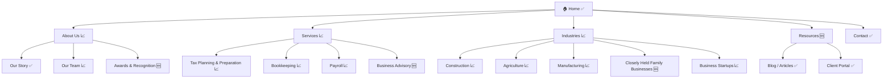

# MFP Proposed Site Map — Generation Guide

This guide governs how to build the Proposed Site Map in Section 10 of every Master Firm Profile. The sitemap must be tailored to the specific firm — not a generic template. Read this guide before writing any sitemap.

---

## Purpose

The proposed sitemap serves two functions:
1. **Strategic** — it shows the client what their new site architecture should look like, grounded in their services, niches, and content gaps.
2. **Operational** — it becomes the page list that drives content strategy and content generation in subsequent workflow steps.

Every page included must exist for a reason tied to this firm's specific situation. Every page excluded is a deliberate choice too.

---

## Annotation Rules

Use these three annotations on every page node:

| Symbol | Meaning | When to use |
|---|---|---|
| ✅ | Existing content — needs polish | The page exists and has reasonable content; we're improving it, not building from scratch |
| 📈 | Existing page — needs major depth | The page exists but is thin, generic, or missing niche-specific content |
| 🆕 | New page — addresses a gap | The page doesn't exist at all; adding it closes a niche, authority, or conversion gap |

Every page in the sitemap MUST have one of these annotations. Never leave a page unannotated.

---

## Standard Page Categories for Accounting / Professional Services Firms

Use this as a starting scaffold, then customize for the specific firm. Not all sections apply to every firm.

### Home
- Always ✅ or 📈 (never 🆕 — it always exists)
- Note: if the homepage is thin or has weak positioning, use 📈

### About
Always include an About section. Sub-pages depend on firm size and differentiation opportunities:

| Sub-page | When to include |
|---|---|
| Our Story / History | Always — especially if firm has 10+ year tenure or notable founding story |
| Our Team | Always — if team bios are absent or thin, mark 📈 |
| Awards & Recognition | 🆕 if firm has awards not on site (e.g., MICPA, Best Workplace); omit if no awards found |
| Our Approach / Philosophy | 🆕 if firm has strong positioning differentiators (e.g., EOS implementation, family-first culture) |
| Community Involvement | 🆕 only if firm has significant community footprint (events, chamber membership, school partnerships) |

### Services
One page per confirmed service. Sub-pages depend on service breadth:

| Service Page | Include when |
|---|---|
| Tax Planning & Preparation | Almost always — this is the primary revenue driver for most CPA firms |
| Bookkeeping | If confirmed on site |
| Payroll | If confirmed on site |
| Business Advisory / CFO Services | If confirmed OR identified as team expertise leverage opportunity |
| Audit & Assurance | If confirmed OR if partner credentials suggest this capability |
| Wealth Planning / Estate Planning | 🆕 if team expertise (credentials, Big 4 background) supports this |
| Nonprofit / 990 Services | 🆕 if identified as niche gap opportunity |
| [Any team-derived service] | 🆕 for each team expertise opportunity identified in Step 6C |

**Sub-page depth rule:** If a service has niche-specific applications (e.g., "Payroll for Construction" vs. "Payroll for Restaurants"), note this in the sitemap comment but do not create separate sub-pages unless the firm is deeply specialized.

### Industries / Who We Serve
One page per confirmed niche AND one page per high-opportunity niche identified in the audit. Do NOT include generic catch-all industry pages — each page must be supported by evidence.

| Industry Page | Annotation rule |
|---|---|
| Confirmed niche with weak site copy | 📈 — page exists but needs niche-specific depth |
| Confirmed niche with no dedicated page | 🆕 — they serve this audience but have no page for it |
| High-opportunity niche from audit | 🆕 — new territory supported by team expertise or market demand |

### Resources
Include only if the firm has content assets or if a resources section is recommended as a gap-closer:

| Sub-page | When to include |
|---|---|
| Blog / Articles | ✅ if they have a blog; 🆕 if they don't but content marketing is recommended |
| FAQs | 🆕 if common prospect questions are unanswered on the site |
| Tax Tips / Newsletter | 🆕 only if firm has shown content creation capacity (existing blog, social posts, etc.) |
| Client Portal | ✅ if they have one; omit entirely if no portal exists |

### Contact
- Always ✅ or 📈
- Mark 📈 if: no email on contact page, hours missing, no embedded map, no intake form

---

## Mermaid Diagram Rules

```
graph TD
```

Use `graph TD` (top-down) for all sitemaps. Do not use LR (left-right) — it gets too wide for most viewers.

**Node ID rules:**
- Use short camelCase IDs: `Home`, `About`, `Services`, `TaxPrep`, `Construction`, etc.
- Use quoted display labels with annotations: `Home["🏠 Home ✅"]`

**Depth rules:**
- Maximum 3 levels deep in the Mermaid diagram (Home → Section → Sub-page)
- If a section has more than 6 sub-pages, group the sub-pages by category rather than listing all individually

**Example structure:**



---

## Text Tree Rules

The text tree follows the Mermaid diagram in the MFP. It must match exactly. Format:

```
Home ✅
├── About Us 📈
│   ├── Our Story ✅
│   ├── Our Team 📈
│   └── Awards & Recognition 🆕
├── Services 📈
│   ├── Tax Planning & Preparation 📈
│   ...
└── Contact ✅
```

Use `├──` for all items except the last in a group, which uses `└──`. Use `│   ` for continuation lines.

---

## How to Determine Which Pages to Include

Work through these questions in order:

1. **From confirmed services (Agent E):** Each confirmed service → one service page (✅ or 📈 depending on copy depth)
2. **From confirmed niches (Agent E):** Each confirmed niche → one industry page (✅ or 📈)
3. **From niche gaps (Agent E niches_invisible + Section 9 gap analysis):** Each high-opportunity niche → one new industry page (🆕)
4. **From team expertise (Step 6C cross-reference):** Each leverage opportunity → evaluate whether it warrants a dedicated service or industry page (usually 🆕)
5. **From authority gaps (Section 9):** Awards not on site → Awards & Recognition page (🆕); thought leadership noted → Resources section (🆕)
6. **From conversion gaps (Section 9):** Missing testimonials → consider a Testimonials/Results page (🆕); missing intake form → flag Contact as 📈
7. **From firm size/team:** Large team → full Team sub-pages with individual bios; small team → single team page

---

## What NOT to Include

- Do NOT include pages purely because they're "standard" — every page needs a reason from this firm's specific data
- Do NOT include separate sub-pages for every service variation unless the firm has dedicated niche content for each
- Do NOT include a Resources section unless there's evidence the firm can produce content OR it's a direct recommendation
- Do NOT include a Community page unless community engagement is a documented differentiator for this firm

---

## Sitemap Comment Block

After the Mermaid diagram, include a brief comment block explaining the key architectural decisions:

```markdown
**Why this structure:**
- [Page] is 🆕 because [specific gap from Section 9]
- [Page] is 📈 because [specific weakness from audit]
- [Industry page] targets [niche] based on [evidence — e.g., "partner credentials and external niche signals from Step 6C"]
```

This comment block becomes useful context during the client review session.
